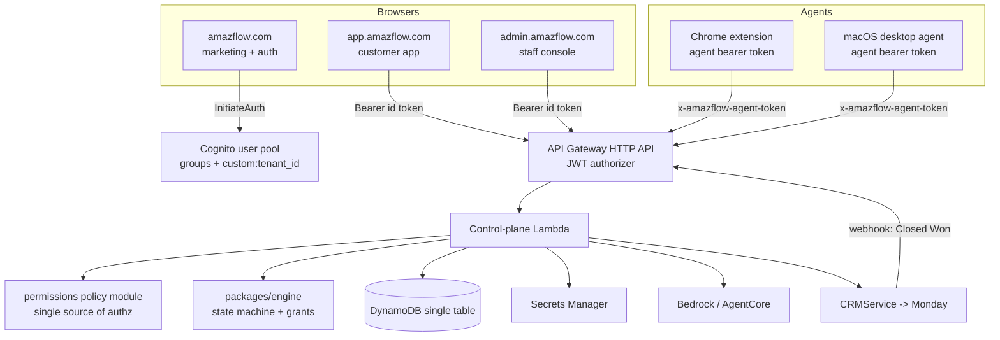
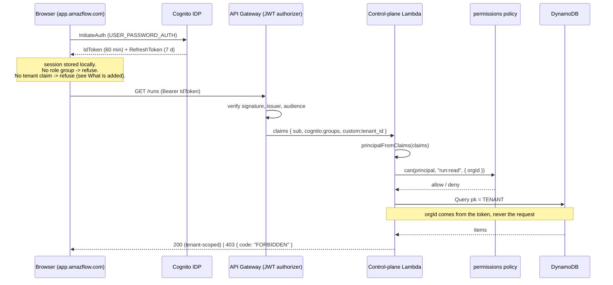
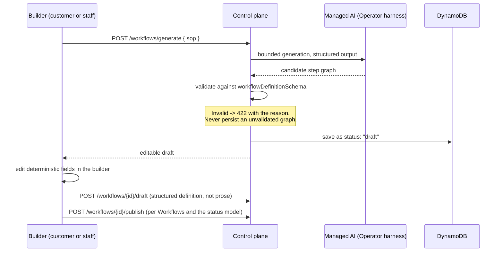
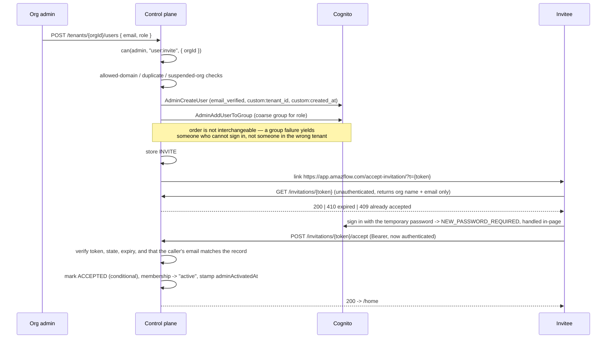

# Design Document: platform-restructure

## Overview

AmazFlow today is a **working execution platform behind a fragmented set of user interfaces**. The
control plane really does what the README claims: it pins workflow versions, dispatches work to two
distinct agent surfaces, issues signed single-use execution grants, takes single-winner task leases,
independently re-verifies what an agent reports, records evidence, and writes an audit trail. That
machinery is not the problem and this design does not touch its semantics.

The problem is above it. There are two unrelated front-end applications (`/app` for staff, `/console`
for customers) with two design systems, two routers, two status vocabularies, two run-detail
implementations, and four copies of the auth gate. The customer surface exposes three screens against
a backend that supports fifteen. Authorization is fifty-odd inline `if (a.role !== …)` checks scattered
through a 4,700-line handler. And there are **two divergent copies of the control plane**, only one of
which is deployed.

This design restructures the platform into three surfaces — a public marketing site, one cohesive
customer application, and a separately-hosted internal staff console — on top of the existing engine,
existing database, existing auth provider, and existing hosting. It adds the organization/onboarding/CRM
layer the business needs, centralizes authorization into a single policy module, and states plainly
which pages become functional, which are honestly disabled, and which are deleted.

**Framework, database, auth provider, and hosting are unchanged.** *Architecture → Target surfaces and
hosting topology → Three surfaces, and the honest limit of a static bundle* records the one hosting
*topology* change (three Amplify applications instead of one) and why it is a deployment-configuration
change rather than a platform change.

---

## Architecture

### Baseline: what actually exists (Phase 0 inspection)

Everything in this section was read out of the repository. It is the factual baseline the rest of the
design is written against. Where the repo already solves a requirement, this design reuses it and says so.

The single table's key layout is recorded separately, under **Data Models → The single table, as built**.

#### Stack, as built

| Concern | Actual implementation | Design consequence |
|---|---|---|
| Frontend | `apps/web`, Next.js 15 App Router, React 19, `output: "export"` + `trailingSlash` | **Static export: there is no frontend server.** No middleware, no server components, no dynamic route segments. Every "protected route" is a client-side gate today, and that cannot become a security boundary. |
| Frontend routing | `output: "export"` means only prebuilt `index.html` files exist. `/app` fakes deep routes with `pushState` + an Amplify rewrite (`/app/<*>` → `/app/index.html`); `/console` does the same inline and documents shareable run links as a known limitation | The rewrite rules live in the Amplify console, **not** in `amplify.yml` — undocumented deploy state (Risk R-4). |
| Hosting | AWS Amplify Hosting, one app, `amplify.yml` already uses the monorepo `applications: [{ appRoot: apps/web }]` form | Adding surfaces = adding `applications` entries + Amplify apps. No new hosting technology. |
| Backend | One Node Lambda behind API Gateway **HTTP API v2**, Cognito JWT authorizer, dispatch via a single `if (route === …)` chain on `e.routeKey` | Route table is explicit and enumerable — good for a traceability matrix, bad for consistency. |
| Database | DynamoDB, **single table**, `pk`/`sk`, PAY_PER_REQUEST, PITR enabled, TTL attribute `ttl`, **zero GSIs** | Any new access pattern is either a partition Query or a full Scan. Cross-tenant staff reads are Scans today. |
| Auth | AWS Cognito user pool `amazflow-dev-users` | Reused as-is. Already MFA-capable (*Auth and session mechanics, as built*). |
| AI | Bedrock Converse (`us.anthropic.claude-sonnet-4-6`) + AgentCore harnesses; customer-facing label is already "AmazFlow managed AI" | Requirement 17 is already partially solved by `ops/terms.ts` and the `aiRuntimeLabel` field. |
| Email | SES v2, `LEAD_TO`/`LEAD_FROM` hardcoded to `hello@amazflow.com` because the account is in the SES sandbox | Blocks transactional email beyond Cognito's own (Risk R-6). |
| Observability | `console.log/error` JSON lines + `emitApplicationMetric()` writing CloudWatch EMF (`AmazFlow/AgentCore` namespace, metrics incl. `ScanTruncated`, `AgentFailure`) | Structured logging exists but has no request/correlation id. |
| CI | `.github/workflows/ci.yml` — control-plane suite, engine, schema, both agent contract suites, web typecheck, static-export build, plus a job that diffs the committed extension zip against a fresh build. No AWS credentials needed. | Extend, don't replace. |

#### Two control planes, drifted in both directions

This is the single most important finding, because it determines what "deploy" means for every phase.

| | `infrastructure/aws-cdk/amazflow-dev.yaml` (inline `ZipFile`) | `services/control-plane/src/handler.ts` (4,711 lines) |
|---|---|---|
| Status | **This is production.** Deployed by hand to stack `amazflow-dev` in `us-east-1` | Canonical source. **Deployed nowhere.** |
| Has, and the other does not | `GET /workflows/{id}/preflight`, `POST /runs/{id}/executor/invoke`, `agentSnapshot()`, heartbeat that accepts `capabilities`/`permissions` | All `/connections/browser*` routes, AgentCore provider modules, the `"AmazFlow managed AI"` response labels |
| Tests | `critical-path.test.cjs` extracts this file's inline handler and runs it against an in-memory DynamoDB + user pool (`test/harness.cjs`) | Only reached indirectly, by regex, from `source-parity.test.cjs` |

`infrastructure/aws-cdk/src/app.ts` plus `services/control-plane` describe a more ambitious CDK stack
(deny-by-default Gateways, policy engines, Memory, managed Browser, encrypted recordings). Per
`README.md` and `docs/ARCHITECTURE.md` it is **not built and not deployed** — target architecture, not
production.

`source-parity.test.cjs` (~44 invariants) and `provider-parity.test.cjs` guard against the two copies
diverging on any security invariant. They are **regex presence checks, not behavioural tests** — they
prove a line exists in both files, not that both behave the same. They already failed to catch the
route-level drift above, because they only assert the invariants someone thought to list.

> **Design decision D-1.** Every backend change in this design lands in **both** copies, with a
> matching entry added to `source-parity.test.cjs`, until the canonical stack is actually deployed and
> staged. Convergence is scheduled as its own phase (*Phased Implementation Sequence*, Phase 0b) and is
> a prerequisite for the CRM webhook, which must not exist in only one copy.

#### Execution model, as built — preserve verbatim

This is the part the hard constraints protect. Recorded here so no later section accidentally
contradicts it.

- **Two surfaces.** `browser_extension` → `CHROME_EXTENSION`; `desktop_agent` → `DESKTOP_AGENT`.
  `packages/workflow-schema` derives a step's surface from its provider (`targetForProvider`) and
  validates that the step's `operation` is in that surface's action vocabulary (`BROWSER_ACTIONS`,
  `DESKTOP_ACTIONS`). `requiredTargets(workflow)` is derived from the steps, so it cannot drift.
- **Capability-aware claiming.** `agentMayRunTask(task, ctx)` requires: same `tenantId`; the task's
  target maps to this agent's `agentType`; the agent's advertised `capabilities` include
  `task.operation`; the caller's role is in `task.assignedRoles`; and a `FRONTLINE` caller only sees
  tasks from runs they created.
- **Single-winner lease.** `acquireTaskLease` does a conditional `PutItem` on
  `attribute_not_exists(pk) OR leaseExpiresAtMs < :nowMs`. Self-healing: an expired lease can be taken
  over, so a dead agent does not strand a run. `sweepExpired()` (EventBridge, `source: "amazflow.sweep"`)
  returns stalled work to the pool.
- **Execution grants.** `packages/engine/src/execution-grant.ts` — `v1.{base64url payload}.{HMAC-SHA256}`,
  secret ≥32 bytes, 300 s TTL, `allowedTools: ["record_step_result", "agent.report_result"]`, binding
  `runId`, `tenantId`, `workflowId`, `workflowVersion`, `stepId`, `taskId`, `agentId`, `agentType`,
  `executionTarget`, `actionType`, `destination`, `confirmationGranted`. `verify()` re-checks every
  expected field against records **loaded server-side**, checks the tool, and consumes a per-tool
  replay marker.
- **Independent verification.** The engine re-tests `step.verify` against what the agent reported; a
  self-declared success that does not hold up becomes `VERIFICATION_FAILED` and does **not** advance
  the run.
- **Evidence.** `stepResults[stepId].evidence = { taskId, agentId, grantId, claimedAt, reportedAt,
  page, verified, expected, actual }`.
- **Heartbeat.** `POST /agent/heartbeat` every 2 minutes (`chrome.alarms` `periodInMinutes: 2`;
  desktop `HEARTBEAT_MS = 120000`). Agent status in the UI is derived from `lastSeenAt`/`lastHeartbeatAt`
  — there is no fake online indicator to remove.
- **Preflight.** `GET /workflows/{id}/preflight` (deployed copy only) refuses to start a run whose
  required surface is not connected, rather than letting it time out.

**Real run statuses** (`packages/workflow-schema`, `RunStatus`):
`RUNNING | AWAITING_CONFIRMATION | WAITING_AGENT | WAITING_APPROVAL | CANCELLED | TIMED_OUT | COMPLETED | FAILED`.
`LIVE_RUN_STATUSES` (used for the org concurrency ceiling) is the positive list
`RUNNING, WAITING_AGENT, WAITING_APPROVAL, AWAITING_CONFIRMATION` — deliberately positive so an
unrecognised status fails *open*.

**Real workflow statuses:** `draft | active | paused`, where `active` means published-and-runnable.

#### Auth and session mechanics, as built

- Pool: `UsernameAttributes: [email]`, password ≥12 with all four character classes,
  `PreventUserExistenceErrors: ENABLED`, `AccountRecoverySetting: verified_email`.
- **`MfaConfiguration: OPTIONAL` with `EnabledMfas: [SOFTWARE_TOKEN_MFA]` is already set.** MFA is a
  UI-and-flow gap, not an infrastructure gap.
- App client: `GenerateSecret: false`, `ExplicitAuthFlows: [ALLOW_USER_SRP_AUTH,
  ALLOW_USER_PASSWORD_AUTH, ALLOW_REFRESH_TOKEN_AUTH]`, id/access token **60 minutes**, refresh token
  **7 days**.
- Groups: `FRONTLINE`, `CLIENT_ADMIN`, `SUPER_ADMIN`. Custom attributes `custom:tenant_id` (mutable,
  **not required**) and `custom:created_at` (unix seconds, stamped at invite).
- `apps/web/app/lib/cognito-auth.ts` calls the Cognito IDP REST API directly with
  `USER_PASSWORD_AUTH` so no page ever shows AWS branding. Already implements: silent refresh
  (`resolveSession`), a non-destructive read (`peekSession`) distinct from the access gate
  (`loadSession`), true sign-out via `RevokeToken`, a bfcache guard that force-reloads on
  `pageshow.persisted`, and refusal to build a session for a user in **no** role group.
- Session lives in `localStorage` under `amazflow_session`. `COGNITO_CLIENT_ID` and the API base URL
  are hardcoded constants in that module.
- Server side, `auth(e)` reads `requestContext.authorizer.jwt.claims` and parses `cognito:groups`
  out of API Gateway's literal bracketed string form.

Two real weaknesses: `sessionFromAuthResult` **defaults `tenantId` to `"amazflow"`** when the claim is
absent, and the handler's `auth()` returns `tenantId: undefined` in the same case. `docs/ONBOARDING.md`
documents that the invite route makes a missing claim impossible *going forward*, but the defaulting
code is still the fallback.

#### Authorization, as built

There is no policy module. Authorization is per-route inline checks:

- **Staff-only (`SUPER_ADMIN`)**: `POST /workflows`, `GET|POST /organizations`,
  `PUT /organizations/{slug}`, `POST /workflows/generate`, `GET /leads`, `GET /activity`,
  `GET|POST /settings`, all `/copilot/*`, `POST /runs/{id}/executor/invoke`.
- **Frontline-denied**: `GET /agents`, `POST /agent-authorizations`, `POST /agents/{id}/revoke`,
  `GET /agent-tasks`, `POST /agent-tasks/{id}/result`, `POST /runs/{id}/approvals/{stepId}`,
  `GET|POST /tenants/{t}/users`, `POST /tenants/{t}/users/{u}/status`,
  `POST /organizations/{slug}/settings`, `POST /organizations/{slug}/branding`.
- **Own-tenant**: the literal `a.role !== "SUPER_ADMIN" && slug !== a.tenantId` repeated at each site.
- **Row filtering**: `GET /runs` and `GET /support/tickets` filter to `createdBy === a.userId` for
  `FRONTLINE`.
- **Unauthenticated at the gateway**: `GET /health`, `POST /leads`,
  `POST /agent-authorizations/{code}/exchange`, `GET /organizations/{slug}/branding`, and all
  `/agent/*` (which authenticate with the agent's own hashed bearer token via
  `x-amazflow-agent-token`, deliberately not a Cognito JWT).

The checks are correct where they exist. The problem is that they are unenumerable, untestable as a
set, and there is no single place to add a role.

#### Frontend, as built

`/app` (staff) is genuinely mature and is the source of most reusable material:

| Module | Lines | What it already gives us |
|---|---|---|
| `ops/data.tsx` | ~904 | One provider owning every read; per-resource error map so one dead endpoint never blanks the console; 15 s live polling paused on a hidden tab; lazy per-entity slots; cross-entity indexes; **explicit `null` for telemetry the platform does not have** |
| `ops/primitives.tsx` | 1,168 | The design system: cards, tables, pills, drawers, modals, `ToastProvider`, search input, skeletons |
| `ops/terms.ts` | 548 | The single label-translation boundary. Backend enums → operator language. `RUN_STATUS_LABEL/TONE`, `LIVE_STATUSES`, `EXCEPTION_STATUSES`, `CANCELLABLE_STATUSES` |
| `ops/run-model.ts` | 645 | Derives the whole run narrative from real data: `stepProgression`, `toolCalls`, `decisions`, `gates`, `grantScopes`, `timeline`, `diagnose`, and `retryPolicy` which honestly reports `attemptsRecorded: null` |
| `ops/router.ts` | 207 | 14 sections, path↔view mapping, nav groups, `g`-then-letter shortcuts, legacy path aliases |
| `ops/nav.tsx` | 152 | Nav context, theme, breadcrumb labels, command palette state |
| `workflow-builder.tsx` | 1,388 | Field-level no-code step editor per action type |

`/console` (customer) is thin by comparison: `page.tsx` (397 lines) with exactly three views
(home / run / team), plus standalone `/console/settings/` and `/console/support/` pages that each
re-implement their own auth gate.

#### Duplication between `/app/ops/*` and `/console/*`

| Concern | Staff implementation | Customer implementation | Verdict |
|---|---|---|---|
| Run detail | `ops/views/run-detail.tsx` (1,408) | `console/run-detail.tsx` (400) | **DUPLICATED** — same run doc, two renderers, two vocabularies |
| Status / provider labels | `ops/terms.ts` | `console/copy.ts` (`statusInfo`, `PROVIDER_BACKEND_LABELS`) | **DUPLICATED** — two mappings of one enum; they can and do disagree in tone |
| Org settings + branding form | `ops/views/customers.tsx` tabs | `console/settings/page.tsx` | **DUPLICATED** — same two routes, two forms; the customer copy shipped with a wrong type (`primaryColor` vs stored `accent`) and missing CSS |
| Team / users | `ops/views/users.tsx` + invite UI in `customers.tsx` | `console/team.tsx` | **DUPLICATED** — same `/tenants/{t}/users` routes |
| Support | `ops/views/support.tsx` | `console/support/page.tsx` | **DUPLICATED** |
| Routing | `ops/router.ts` (declarative) | inline `viewToPath`/`pathToView` in `console/page.tsx` | **DUPLICATED**, and the customer one supports 3 paths |
| Design system | `ops.css` + `primitives.tsx` | `console.css` + inline `style={{…}}` | **DUPLICATED** |
| Auth gate | `app/page.tsx` | `console/page.tsx`, `console/settings/page.tsx`, `console/support/page.tsx` | **DUPLICATED ×4** — same `resolveSession` → redirect block copy-pasted |

#### Honesty defects found (each becomes a work item)

| # | Finding | Evidence |
|---|---|---|
| H-1 | `GET /support/intercom-identity` is called by `apps/web/app/lib/intercom.tsx` but **does not exist**. It 404s, so the Intercom messenger boots **unverified** — a signed-in user could set another customer's `user_id` | `docs/INTERCOM.md` states this outright |
| H-2 | Labour-savings figures are estimate × a hardcoded rate. `console/copy.ts` `computeStats()` and backend `tenantSummary()` both derive `hoursSaved`/`dollarEstimate` from `workflow.manualMinutesEstimate` and `BLENDED_HOURLY_RATE = 35` | Presented to customers as savings |
| H-3 | Organization `plan` is **read by nothing**. Recorded for reporting only | `docs/ORGANIZATION-SETTINGS.md` admits it |
| H-4 | `step.retry.maxAttempts` exists in the schema; **no execution path reads it** and no attempt counter is persisted | `ops/run-model.ts` already reports this honestly |
| H-5 | Lambda `reply()` sets `access-control-allow-origin: *`, contradicting the gateway's `CorsConfiguration` allowlist. The gateway also allows only `GET, POST, OPTIONS` while the canonical source exposes `DELETE /connections/browser/{id}` | Template vs handler |
| H-6 | `EXECUTION_GRANT_SECRET` is a CloudFormation `NoEcho` **parameter baked into the template** | `docs/AGENTCORE_CUTOVER.md`: move to Secrets Manager before this carries real customer actions |
| H-7 | `docs/agent-notes-2026-09/MISSING_FLOWS.md` is stale. It calls the missing `/agent-authorize` page the highest-priority gap; the extension now self-authenticates and needs no such page | Contradicted by `README.md` and `apps/browser-agent/src/auth.ts` |
| H-8 | Changing an existing user's role has **no route**. Neither console offers it | `docs/ONBOARDING.md` "Still manual" |

Nothing else in the frontend fabricates data. `ops/data.tsx` and `ops/run-model.ts` are unusually
disciplined about representing absent telemetry as `null`. **That discipline is the standard this
design adopts**, not something it introduces.


---

### Inventory and classification

#### Backend modules

| Module / capability | Class | Action |
|---|---|---|
| `packages/engine` state machine, `resumeFrom*`, independent verification | **WORKS** | Preserve. No semantic change. |
| `packages/engine/execution-grant.ts` | **WORKS** | Preserve. Move the secret to Secrets Manager (H-6). |
| `packages/workflow-schema` (step union, surfaces, `requiredTargets`, run/connection types) | **WORKS** | Extend additively only. |
| Task lease + `sweepExpired` | **WORKS** | Preserve. |
| Agent auth code → hashed credential exchange, `installationId` reuse, supersede-on-reconnect | **WORKS** | Preserve. |
| Heartbeat + `agentSnapshot()` derived status | **WORKS** (deployed copy) | Port to canonical copy. |
| `GET /workflows/{id}/preflight` | **WORKS** (deployed copy only) | Port to canonical copy; surface in customer UI. |
| Org profile/settings routes + run-creation gates | **WORKS** | Preserve; extend fields (*Data Models → Organization, extended*). |
| Invite route (`POST /tenants/{t}/users`) | **WORKS** | Preserve; add resend/revoke/role-change (*Components and Interfaces → Functional areas → User management*). |
| `logActivity` admin audit | **PARTIALLY WORKS** | Real, but no correlation id and coverage is uneven. Harden (*Audit Coverage*). |
| `scanType` staff cross-tenant **Scan** | **PARTIALLY WORKS** | Correct but truncatable at `PAGE_GUARD`. Add a GSI (*Data Models → A cross-tenant index*). |
| `listTenantUsers` (ListUsersInGroup × groups, then filter the whole pool by `custom:tenant_id`) | **PARTIALLY WORKS** | Correct, O(pool), and the *only* record of membership. Replace as the source of truth with `MEMBERSHIP#` records (*Data Models → Membership and teams*). |
| `tenantSummary` `dollarEstimate` / `totalMinutesSaved` | **MOCK/HARDCODED** | Remove `dollarEstimate` from customer surfaces; relabel minutes as an estimate (*Connections, integrations and analytics*, H-2). |
| Organization `plan` | **DEAD as a control** | Keep as a recorded commercial field, label it as reporting-only, or wire it to real limits. Do not let it look like a limit (H-3). |
| `step.retry.maxAttempts` | **DEAD** | Either implement retries or remove from the schema. Do not render it (H-4). |
| `POST /runs/{id}/executor/invoke` | **PARTIALLY WORKS** | Real but explicitly a SUPER_ADMIN proof-of-concept diagnostic. Keep, label as diagnostic, staff-only. |
| `POST /ai/execute` | **PARTIALLY WORKS** | Bounded AI, but authorized for **any** signed-in role. Restrict (*Authorization fixes this exposes*). |
| `access-control-allow-origin: *` | **MOCK/HARDCODED** | Replace with a per-origin allowlist echo (H-5). |
| `services/api/src/server.ts` (40 lines) | **WORKS, non-production** | Keep as the engine sandbox. Never deploy. Label in docs. |
| `infrastructure/aws-cdk/src/app.ts` + `services/control-plane` as a *stack* | **PARTIALLY WORKS** | Target architecture, undeployed. Do not present as production. |
| Two control-plane copies | **DUPLICATED** | Converge (D-1, *Phased Implementation Sequence* Phase 0b). |

#### Frontend modules

| Module | Class | Action |
|---|---|---|
| `ops/primitives.tsx` | **WORKS** | **Promote** to `apps/web/app/lib/ui/` as the one shared design system. |
| `ops/terms.ts` | **WORKS** | **Promote** to shared. Make it the only enum→label mapping in the repo. |
| `ops/run-model.ts` | **WORKS** | **Promote** to shared. One run narrative, two presentation depths. |
| `ops/data.tsx` | **WORKS** | Generalize into a shared provider parameterized by surface + permissions. |
| `ops/router.ts` + `ops/nav.tsx` | **WORKS** | Generalize; customer route table added alongside the staff one. |
| `ops/views/*` (12 views) | **WORKS** | Keep on the staff surface. Split shared read models out. |
| `workflow-builder.tsx` | **PARTIALLY WORKS** | Real, field-level, schema-driven. Needs the natural-language/SOP entry point wired for customers (*No-code workflow builder*). |
| `ops/copilot.tsx` | **WORKS, staff-only** | Keep staff-only. Draft-first write path is already correct. |
| `console/copy.ts` status/provider maps | **DUPLICATED** | Delete; re-point at shared `terms.ts`. |
| `console/copy.ts` `computeStats` (`hoursSaved`, `valueSaved`) | **MOCK/HARDCODED** | Delete the money figure; keep real counts (H-2). |
| `console/run-detail.tsx` | **DUPLICATED** | Delete; replace with the shared run view at customer depth. |
| `console/team.tsx` | **DUPLICATED** | Delete; replace with the shared users module. |
| `console/settings/page.tsx` | **DUPLICATED** | Delete; replace with `/settings` + `/admin/organization` routes. |
| `console/support/page.tsx` | **DUPLICATED** | Delete; replace with the shared support module. |
| `console/page.tsx` inline router | **DUPLICATED** | Delete; use the shared router. |
| `console.css` | **DUPLICATED** | Delete; one token set + one stylesheet. |
| Auth gate copy-pasted ×4 | **DUPLICATED** | Replace with one `<RequireSession>` boundary. |
| `app/agent-test/page.tsx` | **DEAD** (unlinked test harness on the public site) | Remove, or move behind the staff surface. |
| `intercom.tsx` call to `GET /support/intercom-identity` | **PARTIALLY WORKS** | Implement the endpoint, or stop pretending to verify (H-1). |
| `company/page.tsx` `cms-placeholder` block | **INTENTIONALLY DISABLED** | Already honestly labelled. Leave. |
| `flagship-demo.tsx` / `/demo` | **WORKS** | Marketing simulation, ungated by design. Keep on the marketing surface; label as a simulation. |
| `docs/agent-notes-2026-09/MISSING_FLOWS.md` | **DEAD** | Delete or mark superseded (H-7). |

#### Every page, classified

The rule from the constraints: each page ends up **FUNCTIONAL**, **INTENTIONALLY DISABLED** (honestly
labelled), or **REMOVE**.

**Marketing — `amazflow.com`** (all currently real): `/`, `/product`, `/solutions`, `/security`,
`/pricing`, `/company`, `/contact`, `/demo`, `/legal`, `/privacy`, `/terms`, `/dpa`, `/cookie-policy`,
`/acceptable-use`, `/subprocessors` → **FUNCTIONAL**, unchanged. `/agent-test` → **REMOVE**.

**Auth pages** (shared origin-agnostic): `/login`, `/forgot-password`, `/reset-password`,
`/signed-out` → **FUNCTIONAL**. New: `/accept-invitation`, `/change-password` → FUNCTIONAL;
`/mfa-setup` → **INTENTIONALLY DISABLED** with "Two-factor authentication is coming; your account
already supports it at the identity-provider level" (pool already permits TOTP, *Auth and session
mechanics, as built*).

**Customer app — `app.amazflow.com`**

| Route | Class | Backing |
|---|---|---|
| `/home` | FUNCTIONAL | `/workflows`, `/runs`, onboarding checklist |
| `/workflows`, `/workflows/:id` | FUNCTIONAL | `GET /workflows`, `/versions`, `/preflight` |
| `/workflows/new`, `/workflows/:id/edit` | FUNCTIONAL for Workflow Builder role; **staff-gated until publish** | `POST /workflows` is `SUPER_ADMIN`-only today — see the *Workflows and the status model* decision |
| `/runs`, `/runs/:runId` | FUNCTIONAL | `GET /runs`, shared run model |
| `/tasks` | FUNCTIONAL | `GET /agent-tasks` |
| `/approvals` | FUNCTIONAL | runs at `WAITING_APPROVAL` + `POST /runs/:id/approvals/:stepId` |
| `/exceptions` | FUNCTIONAL | `FAILED`/`TIMED_OUT` runs + cause classification (*Exceptions, differentiated by cause*) |
| `/agents` | FUNCTIONAL | `GET /agents` (heartbeat-derived), `POST /agent-authorizations`, `/revoke` |
| `/connections` | FUNCTIONAL **once the canonical stack is deployed**; until then INTENTIONALLY DISABLED with the reason | `/connections/browser*` exists only in the undeployed copy (*Two control planes, drifted in both directions*) |
| `/analytics` | FUNCTIONAL, reduced | Real counts/rates/durations only; no money figure (H-2) |
| `/admin/organization` | FUNCTIONAL | `GET /organizations/{slug}`, `POST …/settings`, `…/branding` |
| `/admin/users` | FUNCTIONAL | `/tenants/{t}/users` + status; role change needs the new route (H-8) |
| `/admin/teams` | FUNCTIONAL | New `TEAM#`/`MEMBERSHIP#` records (*Data Models → Membership and teams*) |
| `/admin/roles` | FUNCTIONAL, read-mostly | Renders the real policy matrix (*Authorization: the permissions policy module*); custom roles INTENTIONALLY DISABLED |
| `/admin/security` | FUNCTIONAL, reduced | Session/password policy facts + agent credential list. SSO/SCIM panels INTENTIONALLY DISABLED |
| `/admin/audit` | FUNCTIONAL | `GET /activity`, tenant-scoped (needs the authz fix in *Authorization fixes this exposes*) |
| `/admin/billing` | **INTENTIONALLY DISABLED** | No billing system exists. Shows plan + contact, labelled "managed by your AmazFlow contact" |
| `/settings/profile`, `/settings/notifications` | FUNCTIONAL | Cognito attrs + `NOTIFICATION#` prefs |
| `/settings/security` | FUNCTIONAL | Change password, active-session facts, sign out everywhere |

**Internal staff — `admin.amazflow.com`**: all 14 existing `/app` sections carry over as
**FUNCTIONAL**. New: `/internal/onboarding` (FUNCTIONAL), `/internal/crm` (FUNCTIONAL),
`/internal/health` (FUNCTIONAL — `GET /health` + real EMF metrics), `/internal/flags`
(FUNCTIONAL only for flags wired to real runtime behaviour; anything else is not shipped),
`/internal/impersonation` (**INTENTIONALLY DISABLED in v1** — see *Security Considerations*),
`/internal/billing` (**INTENTIONALLY DISABLED** until a billing provider exists).

> No page ships with a control that does nothing. The `plan`-field precedent (H-3) is exactly the
> failure mode this rule exists to prevent: a stored value the console presented as a limit for months
> without it ever being one.

---

### Target surfaces and hosting topology

#### Three surfaces, and the honest limit of a static bundle

Requirement 1 asks for a separate internal staff surface that "customers must never reach via URL
manipulation". The frontend is a **static export** (*Stack, as built*): there is no frontend server, so
no server-side redirect or middleware can enforce that. This must be stated plainly rather than designed
around.

> **Design decision D-2 — a static bundle is not a security boundary.**
> The authorization boundary is, and only is, the control plane: API Gateway's Cognito JWT authorizer
> plus a server-side `SUPER_ADMIN` check on every internal route. Serving the staff bundle from a
> separate origin is **defence in depth and anti-confusion**, not the control. If a customer
> downloads the admin JavaScript, they get an empty shell whose every request is refused with 403.
> The design is verified by the API-level tests in *Testing Strategy*, never by "the customer cannot
> load the page".

Hosting topology becomes three Amplify Hosting applications built from the same monorepo — `amplify.yml`
already uses the multi-application form, so this is added configuration, not new technology:

| Origin | Build | Contents | Cognito callback |
|---|---|---|---|
| `amazflow.com` | `apps/web` marketing entry | Public pages, `/demo`, legal set, `/login` and the auth pages | `https://amazflow.com/login/` |
| `app.amazflow.com` | `apps/customer` | The one cohesive customer app | `https://app.amazflow.com/` |
| `admin.amazflow.com` | `apps/internal` | Staff console (today's `/app` sections + the new internal ones) | `https://admin.amazflow.com/` |

Shared code moves to `packages/ui` (design system, promoted from `ops/primitives.tsx`),
`packages/domain-ui` (`terms.ts`, `run-model.ts`, read models), and `packages/api-client` (typed fetch
layer + session). All three apps keep `output: "export"`.

Each Amplify app needs one rewrite rule (`/<*>` → `/index.html`) so deep links survive a hard reload —
which also **fixes the shareable-run-link limitation** `console/page.tsx` documents today. These rules
must be committed as infrastructure, not left in the console (Risk R-4).

CORS becomes a per-origin allowlist of exactly these three origins, echoed back rather than `*`, and
`AllowMethods` gains `DELETE` and `PUT` (H-5).



#### Customer app shell

One shell, one route tree, one design system. Structure:

- **Persistent sidebar** built from a permission-filtered route table (*Permission matrix*). A section
  the session cannot use is **absent**, not greyed — except where absence would be confusing, in which
  case it is present and labelled with the reason.
- **Header** with organization name (from `branding.displayName || name`), breadcrumbs
  (`ops/nav.tsx`'s `useDetailCrumb` pattern, promoted), notification bell, user menu.
- **Shared primitives** (promoted from `ops/primitives.tsx`): page header, card, table, button, form
  field, badge, status indicator, modal, drawer, toast (`ToastProvider` already exists), skeleton,
  empty state, error state.
- **Three-state discipline** for every data surface: skeleton while loading, honest empty state with a
  next action, error state carrying a support-referenceable code (*Error Handling*).
- **Responsive down to laptop widths** (≥1024 px) as a hard target; the existing `console.css` mobile
  tab bar shows the smaller breakpoints already work and should be kept for the operator-on-phone case.
- **Live data** reuses `ops/data.tsx`'s polling model: 15 s interval, paused on a hidden tab, immediate
  refresh on return, per-resource error isolation.

#### Customer route map

```
/home
/workflows                /workflows/new   /workflows/:id   /workflows/:id/edit
/runs                     /runs/:runId
/tasks
/approvals
/exceptions
/agents
/connections
/analytics
/admin/organization  /admin/users  /admin/teams  /admin/roles  /admin/security  /admin/audit  /admin/billing
/settings/profile    /settings/security   /settings/notifications
```

#### Internal staff surface

Carries over all 14 existing sections (`overview, runs, approvals, exceptions, workflows, studio,
customers, users, connections, agents, audit, support, leads, settings`) and adds `onboarding`, `crm`,
`health`, `flags`. The existing `ops/router.ts` declarative section table, nav groups, `g`-then-letter
shortcuts, and command palette all carry over unchanged.


---

## Components and Interfaces

### Authentication and session hardening

Reuse `apps/web/app/lib/cognito-auth.ts` — it already implements silent refresh, `RevokeToken`
sign-out, the bfcache guard, the passive-read/access-gate split, and refusal of a role-less session.
Changes are additive.

#### What is added

| Flow | Status today | Change |
|---|---|---|
| Sign in / sign out | Works | Move the four copy-pasted gates into one `<RequireSession>` boundary |
| Forgot / reset password | Works (`ForgotPassword` / `ConfirmForgotPassword`) | Unchanged |
| **Change password** | Missing | New: Cognito `ChangePassword` with the current access token. No operator route can set a customer password — `AdminSetUserPassword` is deliberately not granted |
| Protected routes | Client-side only | Keep the client gate for UX; **all enforcement server-side** (D-2) |
| Session expiration + redirect | Works | Keep `?reason=expired` so the login page can say why |
| Invalid token | Works (refresh fails → clear → `/login`) | Add: a `401` from any API call triggers one refresh attempt, then sign-out |
| **Disabled account** | Partially | Cognito refuses auth for a disabled user, but a *live session* survives until its token expires (≤60 min). Add: `GET /me` returns `accountStatus`, and any `403 ACCOUNT_DISABLED` from the API force-signs-out |
| **Invitation acceptance** | Works but unbranded-adjacent | Cognito emails a temporary password and `/login` handles `NEW_PASSWORD_REQUIRED` in-page. Add `/accept-invitation` as a tokenized entry (*Customer admin invitation flow*) that lands on the same challenge |
| Refresh-safe | Works | Per-app Amplify rewrite makes deep links reload-safe (*Three surfaces, and the honest limit of a static bundle*) |
| Back/forward safe | Works | `guardBFCacheRestore` retained |
| Logout truly revokes | Works | `RevokeToken` already called. Add "sign out everywhere" using the same call plus `AdminUserGlobalSignOut` for staff-initiated revocation |
| **`tenantId` defaulting** | **Defect** | `sessionFromAuthResult` defaults a missing `custom:tenant_id` to `"amazflow"`. Change to **throw** (`AuthError("NoTenant")`) and have the handler's `auth()` return no usable context. A user with no tenant claim must fail visibly, not land in the staff tenant |

#### Prepared for, not implemented

Recorded as architecture so nothing later has to be undone:

- **MFA** — pool already permits TOTP (*Auth and session mechanics, as built*). Needs
  `AssociateSoftwareToken` / `VerifySoftwareToken` / `SetUserMFAPreference` calls plus handling
  `SOFTWARE_TOKEN_MFA` in the `SignInResult` union, which is already a discriminated union with a
  challenge arm.
- **Google / Microsoft login** — pool has `SupportedIdentityProviders: [COGNITO]` and a
  `UserPoolDomain`. Adding a provider is a pool change plus an `IdpChallenge` arm. **The blocker is
  claim mapping**: `custom:tenant_id` and group membership must be assigned at first federated sign-in,
  which requires a pre-token-generation or post-confirmation Lambda trigger. Neither exists.
- **SAML SSO** — same, per-organization IdP, requires `organization.ssoConfig` and an IdP-per-tenant
  naming scheme.
- **SCIM** — requires the `MEMBERSHIP#` record model in *Data Models → Membership and teams* to exist
  first, because SCIM provisions membership, and membership currently has no persistent record at all.

None of these ship in this restructure. The `/mfa-setup` and `/admin/security` SSO panels are the
honestly-labelled placeholders (*Every page, classified*).

#### Sign-in and authorization sequence



---

### Multi-tenant isolation

#### The rule

**Organization context is derived from the authenticated session and never from the request.** The
codebase already follows this: `scanType(type, a)` builds `pk = TENANT#${a.tenantId}` from the token
claim. This design makes it structural rather than conventional.

```typescript
// packages/control-plane-core/src/principal.ts
export type Principal = {
  userId: string;                    // Cognito sub
  orgId: string;                     // from custom:tenant_id — the ONLY source
  group: "FRONTLINE" | "CLIENT_ADMIN" | "SUPER_ADMIN";
  role: PlatformRole;                // fine-grained, from MEMBERSHIP# (see Data Models)
  teamIds: string[];
  isStaff: boolean;                  // group === "SUPER_ADMIN"
};

/** Throws rather than defaulting. A claim-less token yields no principal. */
export function principalFromClaims(claims: Record<string, unknown>): Principal;

/**
 * The only sanctioned way to read tenant data. `orgId` is not a parameter —
 * it is read off the principal, so a caller cannot pass someone else's.
 */
export function tenantScope(p: Principal): { pk: string };

/**
 * Cross-tenant read. Staff only, requires a stated reason, always audited.
 * Named so that every call site is greppable and reviewable.
 */
export function crossTenantScope(p: Principal, reason: string): { staff: true };
```

Every entity is scoped this way: users, workflows, workflow versions, runs, tasks, approvals, evidence,
agents, integrations, secrets, analytics, audit, notifications.

The three places where an org id legitimately arrives in a request stay, and stay staff-only:
`POST /workflows` (`body.tenantId`), `POST /agent-authorizations` (`body.tenantId`), and the
`{tenantId}` / `{slug}` path parameters — each already guarded by
`role !== "SUPER_ADMIN" && x !== a.tenantId`. Those guards move into `can()` so there is one
implementation instead of eleven.

#### Review approach for tenant-crossing vulnerabilities in existing APIs

A concrete audit procedure, not a promise:

1. **Enumerate.** The route table is a literal `if (route === …)` chain. Extract all ~55 route keys
   mechanically into a fixture. Any route not in the fixture fails the build.
2. **Classify each route** into: session-scoped (derives org from token), parameter-scoped (takes an
   org/slug/tenant id), id-scoped (takes an entity id and must re-derive the org from the loaded
   record), unauthenticated, or agent-token-authenticated.
3. **Attack each id-scoped route with a two-org fixture.** This is where the real risk is: routes like
   `POST /runs/{id}/cancel`, `POST /runs/{id}/confirmations/{stepId}/confirm`,
   `POST /agent-tasks/{id}/result`, `POST /runs/{id}/approvals/{stepId}`, and
   `POST /copilot/actions/{id}/apply` receive a bare id. Today they find the entity via
   `scanType(type, a)`, which is *implicitly* tenant-scoped for non-staff — correct, but only because
   of where the scoping happens. The test asserts Org B's id returns 404, not 200 or 403-with-detail.
4. **Specific items already identified for review:**
   - `resumeAgentTask` is invoked from the agent route with a **synthesized**
     `{ role: "SUPER_ADMIN", tenantId: agentCtx.tenantId }`. That is a deliberate privilege elevation
     inside the agent path, gated by `agentMayRunTask`. It must be re-expressed as an explicit
     `AgentPrincipal` so the elevation is visible and cannot be reused by a human-facing path.
   - `claimAgentTask` and `GET /agent/tasks` call `scanType("TASK#", { role: "SUPER_ADMIN" })` — a
     full-table read — then filter with `agentMayRunTask`. Isolation depends entirely on that one
     predicate. It gets property-based tests (*Correctness Properties* P1) and a
     `crossTenantScope(..., reason)` call site.
   - `GET /organizations/{slug}/branding` is **unauthenticated** and returns an org's name and branding
     for any slug — organization enumeration by design, for the sign-in page. Keep, but rate-limit and
     return nothing beyond name/branding.
   - `GET /activity` is staff-only and reads **all** tenants. The customer `/admin/audit` route needs a
     tenant-scoped variant; it must not be built by loosening this one.
   - `PAGE_GUARD` truncation on staff Scans means a cross-tenant list can be silently incomplete. It
     already logs `SCAN_TRUNCATED`; *Data Models → A cross-tenant index* adds the GSI that removes the
     Scan.
5. **Lock it in** with the property tests in *Correctness Properties* and the API-level two-org suite in
   *Testing Strategy*.

---

### Authorization: the permissions policy module

#### The layering decision

Requirement 7 asks for six roles. Cognito has three groups, and those three appear in
`workflow.assignedRoles`, in `agentMayRunTask`, in the agent credential's `userRole`, in
`permissionsByRole` in `packages/workflow-schema`, and in ~50 handler checks.

> **Design decision D-3 — two layers, not a rename.**
> **Cognito groups stay** as the coarse authentication-time claim and the staff/tenant boundary:
> `SUPER_ADMIN` is AmazFlow staff and is never a tenant role; `CLIENT_ADMIN` and `FRONTLINE` remain the
> two claims a customer user can carry. **Fine-grained roles live in a new `MEMBERSHIP#` record**
> (*Data Models → Membership and teams*) and are resolved into the `Principal`. This is additive, needs
> no Cognito migration, and keeps `assignedRoles` working via a documented coarse mapping.

| Platform role | Cognito group | Intent |
|---|---|---|
| `ORG_OWNER` | `CLIENT_ADMIN` | Everything in the org, including billing contact and ownership transfer |
| `ORG_ADMIN` | `CLIENT_ADMIN` | Users, teams, connections, org settings; not ownership |
| `WORKFLOW_BUILDER` | `CLIENT_ADMIN` | Author and edit drafts; publishing per *Workflows and the status model* |
| `OPERATOR` | `FRONTLINE` | Run assigned workflows, see own runs, resolve own tasks |
| `APPROVER` | `CLIENT_ADMIN` | Decide approvals; read runs in scope |
| `VIEWER` | `FRONTLINE` | Read-only, including audit |
| `STAFF_ADMIN` | `SUPER_ADMIN` | AmazFlow internal. Never assignable through a tenant-scoped route |

A member with no `MEMBERSHIP#` record yet resolves to a default from their group
(`CLIENT_ADMIN → ORG_ADMIN`, `FRONTLINE → OPERATOR`), so every existing user keeps working on day one.

`APPROVER` mapping to `CLIENT_ADMIN` matters: `POST /runs/{id}/approvals/{stepId}` currently refuses
`FRONTLINE`, and `workflow.assignedRoles` is typed as the coarse `roleSchema`. Keeping `APPROVER`
coarse-mapped to `CLIENT_ADMIN` means no engine or schema change is needed for approvals to work.

#### Centralized permission policy

One module. No role string is compared anywhere else, in the backend or the frontend.

```typescript
// packages/permissions/src/index.ts

export type Permission =
  | "workflow:read" | "workflow:create" | "workflow:edit" | "workflow:publish"
  | "workflow:archive" | "workflow:run"
  | "run:read" | "run:read_all" | "run:cancel" | "run:confirm"
  | "task:read" | "task:resolve"
  | "approval:read" | "approval:decide"
  | "exception:read" | "exception:resume"
  | "agent:read" | "agent:authorize" | "agent:revoke"
  | "connection:read" | "connection:manage"
  | "secret:reference" | "secret:manage"
  | "org:read" | "org:settings" | "org:branding" | "org:transfer_ownership"
  | "user:read" | "user:invite" | "user:set_status" | "user:set_role"
  | "team:read" | "team:manage"
  | "audit:read" | "analytics:read" | "notification:read"
  | "internal:*";

export type Resource = {
  orgId: string;
  ownerUserId?: string;      // for own-record scoping (OPERATOR)
  assignedRoles?: string[];  // coarse roles a workflow is assigned to
  teamId?: string;
};

export type Decision =
  | { allow: true }
  | { allow: false; reason: string; code: "FORBIDDEN" | "WRONG_ORG" | "NOT_ASSIGNED" };

/**
 * The single authorization entry point, used by the API and by navigation.
 *
 * Preconditions:
 *   - `principal` was built by principalFromClaims from a verified JWT.
 *   - `resource.orgId` came from a record loaded server-side, never from the request body.
 * Postconditions:
 *   - Deny unless an explicit grant exists (deny by default).
 *   - Cross-org is denied for every non-staff principal regardless of permission.
 *   - Pure: no I/O, no clock, no mutation. Same inputs -> same decision.
 */
export function can(principal: Principal, permission: Permission, resource: Resource): Decision;

/** Throwing wrapper used by route handlers. Emits an audit event on deny. */
export function authorize(p: Principal, permission: Permission, r: Resource): void;

/** Drives sidebar/nav. Same policy, no duplicated frontend logic. */
export function visibleSections(p: Principal): SectionId[];
```

`can()` evaluates in a fixed order, and the order is itself the security property:

```
ALGORITHM can(principal, permission, resource)
BEGIN
  // 1. Org boundary first. Nothing below can override it for a non-staff principal.
  IF NOT principal.isStaff AND resource.orgId <> principal.orgId THEN
    RETURN deny("WRONG_ORG")
  END IF

  // 2. Staff scope. Staff hold internal:* and every read; tenant-mutating
  //    permissions are still granted explicitly, so staff writes stay enumerable.
  IF principal.isStaff THEN
    RETURN STAFF_GRANTS.contains(permission) ? allow : deny("FORBIDDEN")
  END IF

  // 3. internal:* is unreachable for any customer role, by construction.
  IF permission starts with "internal:" THEN RETURN deny("FORBIDDEN") END IF

  // 4. Role grant.
  IF NOT ROLE_GRANTS[principal.role].contains(permission) THEN
    RETURN deny("FORBIDDEN")
  END IF

  // 5. Own-record narrowing: a role holding the narrow permission but not the
  //    broad one may only touch its own records.
  IF resource.ownerUserId IS PRESENT
     AND NOT ROLE_GRANTS[principal.role].contains(broadForm(permission))
     AND resource.ownerUserId <> principal.userId THEN
    RETURN deny("FORBIDDEN")
  END IF

  // 6. Workflow assignment, preserving the engine's existing rule exactly.
  IF permission = "workflow:run" AND resource.assignedRoles IS PRESENT
     AND NOT resource.assignedRoles.contains(coarseOf(principal.role)) THEN
    RETURN deny("NOT_ASSIGNED")
  END IF

  RETURN allow
END
```

**Preconditions:** `principal` derives from a verified JWT; `resource.orgId` comes from a server-loaded
record. **Postconditions:** deny by default; cross-org denied before any permission is consulted;
`internal:*` unreachable for customer roles; pure and total. **Loop invariants:** none — there are no
loops, deliberately, so the decision is a fixed-length evaluation with no ordering ambiguity.

#### Permission matrix

`✔` = granted, `own` = own records only, blank = denied.

| Permission | OWNER | ADMIN | BUILDER | OPERATOR | APPROVER | VIEWER |
|---|---|---|---|---|---|---|
| `workflow:read` | ✔ | ✔ | ✔ | ✔ (assigned) | ✔ | ✔ |
| `workflow:create` / `:edit` | ✔ | ✔ | ✔ | | | |
| `workflow:publish` | ✔ | ✔ | see *Workflows and the status model* | | | |
| `workflow:archive` | ✔ | ✔ | ✔ | | | |
| `workflow:run` | ✔ | ✔ | ✔ | ✔ (assigned) | | |
| `run:read` | ✔ | ✔ | ✔ | own | ✔ | ✔ |
| `run:read_all` | ✔ | ✔ | ✔ | | ✔ | ✔ |
| `run:cancel` / `:confirm` | ✔ | ✔ | ✔ | own | | |
| `task:read` / `:resolve` | ✔ | ✔ | | own | | |
| `approval:decide` | ✔ | ✔ | | | ✔ | |
| `exception:read` | ✔ | ✔ | ✔ | own | ✔ | ✔ |
| `exception:resume` | ✔ | ✔ | ✔ | | | |
| `agent:read` | ✔ | ✔ | ✔ | | | ✔ |
| `agent:authorize` / `:revoke` | ✔ | ✔ | | | | |
| `connection:read` | ✔ | ✔ | ✔ | | | ✔ |
| `connection:manage` | ✔ | ✔ | | | | |
| `secret:manage` | ✔ | ✔ | | | | |
| `org:read` | ✔ | ✔ | ✔ | ✔ | ✔ | ✔ |
| `org:settings` / `:branding` | ✔ | ✔ | | | | |
| `org:transfer_ownership` | ✔ | | | | | |
| `user:read` | ✔ | ✔ | | | | ✔ |
| `user:invite` / `:set_status` / `:set_role` | ✔ | ✔ | | | | |
| `team:manage` | ✔ | ✔ | | | | |
| `audit:read` | ✔ | ✔ | | | | ✔ |
| `analytics:read` | ✔ | ✔ | ✔ | | ✔ | ✔ |
| `internal:*` | | | | | | |

Two rules preserved from the current backend regardless of role: `maxConcurrentRuns` is **never**
settable by a customer (an org that can raise its own ceiling has no ceiling), and `SUPER_ADMIN` is
**never** an invitable role.

#### Authorization fixes this exposes

- `POST /ai/execute` currently accepts **any** signed-in role. Restrict to `internal:ai_execute`
  (staff) — it is a bounded-AI diagnostic, not a customer feature.
- `GET /activity` is staff-and-all-tenants. Add a tenant-scoped read for `/admin/audit` rather than
  loosening it.
- Role change (H-8) gets a real route: `POST /tenants/{tenantId}/users/{username}/role`, guarded by
  `user:set_role`, refusing `SUPER_ADMIN` for every caller and refusing removal of the last
  `ORG_OWNER`.

#### Extensibility toward granular and custom roles

`ROLE_GRANTS` is a `Record<PlatformRole, Set<Permission>>`. A custom role is the same shape with a
different key, persisted as a `ROLE#{roleId}` record in the org partition, resolved into
`principal.role` grants at principal-construction time. Nothing in `can()` changes. Custom roles are
**not shipped** in this restructure; the data shape simply does not preclude them, and `/admin/roles`
renders the real matrix so the eventual editor has an honest starting point.


---

### Functional areas

#### User management

Backed by the existing Cognito routes plus the new `MEMBERSHIP#` record.

| Capability | Backing | State |
|---|---|---|
| Invite | `POST /tenants/{t}/users` | **Exists.** Creates the user, stamps `custom:tenant_id` and `custom:created_at`, adds the group, reports a partial failure as `502` with "they cannot sign in yet… Retry the invitation" |
| Resend | new `POST …/users/{username}/resend` | Cognito `AdminCreateUser` with `MessageAction: RESEND` |
| Revoke a pending invitation | new `POST …/users/{username}/revoke-invitation` | Only valid while `userStatus === "FORCE_CHANGE_PASSWORD"`; disables the account and marks the membership `deactivated`. **Not** a delete — `AdminDeleteUser` is deliberately not granted |
| Deactivate / reactivate | `POST …/users/{username}/status` | **Exists** (`AdminDisableUser`/`AdminEnableUser`) |
| Remove | — | **Deliberately absent.** Removal is deactivation, which is reversible and keeps the person's audit trail attributable. `/admin/users` says so rather than showing a disabled delete button |
| Assign role | new `POST …/users/{username}/role` | Fixes H-8. Writes `Membership.role`, reconciles the Cognito group if the coarse mapping changes, refuses `SUPER_ADMIN`, refuses demoting the last `ORG_OWNER` |
| Assign team | new `POST …/users/{username}/teams` | Writes `Membership.teamIds` |
| Statuses shown | Invited / Active / Deactivated | Derived from Cognito `userStatus` + `Enabled` + membership, exactly as `isPendingInvite()` already does |
| Last login | `Membership.lastLoginAt` | New. "Not recorded" for users who have not signed in since the change |

Existing guards preserved verbatim: allowed-email-domain check (`422` listing the domains), duplicate
member (`409`), address belonging to another org (`409`, "ask AmazFlow to move them"), suspended org
(`409`), and paused org **allowed** — pausing stops execution, not administration.

#### Teams

New and small: create, rename, delete, add/remove members. Teams are an **organizational grouping and a
notification audience**, not a permission boundary in v1 — `can()` accepts `resource.teamId` so a
future team-scoped grant needs no signature change, but no role uses it yet. Saying this explicitly
avoids shipping a "team permissions" tab that does nothing.

#### Workflows and the status model

**The single non-conflicting status model:**

| UI status | Persisted `status` | Runnable? |
|---|---|---|
| Draft | `draft` | No |
| Testing | `testing` *(new)* | Yes, but only for `WORKFLOW_BUILDER`/`ORG_ADMIN`/`ORG_OWNER`, and runs are tagged `isTest: true` |
| Published | `active` | Yes |
| Archived | `archived` *(new)* | No |

> **Design decision D-5 — extend the enum, keep `active` as the wire value for Published.**
> `active` is read by `POST /workflows/{id}/runs` (`status !== "active"` → 409), by `preflightFor`, by
> `visibleWorkflows`, by the managed-connection check in `POST /workflows`, and by
> `org-settings.test.cjs`. Renaming it to `published` would be a rename of the one value the run gate
> depends on, for cosmetic gain. The label lives in `terms.ts`, which is exactly what that module is
> for. Legacy `paused` records keep parsing and display as **Archived**; nothing writes `paused` again.

Capabilities: list, search, filter (status / provider / required surface / assigned role), create,
edit, duplicate, archive, publish, unpublish (`active → draft`), version history via the existing
`GET /workflows/{id}/versions`, and run. **Required to run** is rendered from
`requiredTargets(workflow)` (already derived from the steps, so it cannot drift) and readiness from
`GET /workflows/{id}/preflight`.

**Who may publish.** `POST /workflows` is `SUPER_ADMIN`-only today, and `README.md` plus
`docs/ONBOARDING.md` both state that AmazFlow staff author workflows by design. Requirement 8 asks for a
customer `WORKFLOW_BUILDER`. The design splits the route rather than loosening it:

- `POST /workflows` (staff, unchanged) — full definition write, any tenant.
- `POST /workflows/{id}/draft` (new, `workflow:edit`) — customer draft writes into their own org only,
  validated by the same `validateWorkflowShape` + Zod schema, and **cannot set `status: "active"`**.
- `POST /workflows/{id}/publish` (new, `workflow:publish`) — a separate transition that re-runs the
  managed-connection check.

Whether `WORKFLOW_BUILDER` gets `workflow:publish` is a **business decision, recorded as open question
Q-1**, not something to guess. Until it is answered, the role holds `workflow:edit` and publish stays
staff-only, and the UI says "your AmazFlow contact publishes this" rather than showing a button that 403s.

#### No-code workflow builder

Reuse `workflow-builder.tsx` (1,388 lines, already field-level and schema-driven, with per-action field
definitions for all 11 browser and 8 desktop actions). Add the natural-language entry point:



The rule the requirement asks for is already how the code works and must stay that way: **the chatbot
is not the engine.** Generation produces a *definition*; the definition is validated by
`workflowDefinitionSchema` (which enforces step-reference integrity, provider allowlists, and
surface/action pairing); execution is the deterministic state machine in `packages/engine`. No run ever
consults a model for control flow. `POST /workflows/generate` already returns `422` with the reason
when generation fails, and `/app` already saves the draft immediately so it survives a refresh.

#### Execution surfaces and agents

No change to mechanics (*Execution model, as built*). UI work only:

- Agent list shows **heartbeat-derived** status — `connected` / `offline` / `revoked` from
  `lastSeenAt`/`lastHeartbeatAt` against the 2-minute heartbeat interval. There is no fake online
  indicator in the codebase to remove; the requirement is already satisfied and must not be regressed.
- Show `agentType`, `platform`, `version`, advertised `capabilities`, and (desktop) granted
  `permissions` — because "waiting instead of running" is usually explained by a missing capability or
  a missing macOS permission, and the agent already reports both.
- Authorize (`POST /agent-authorizations` → code → extension/app exchanges it), revoke
  (`POST /agents/{id}/revoke`), and diagnostics: last heartbeat, current activity, recent claims,
  and the reason a pending task is not eligible for this agent (evaluated with the same
  `agentMayRunTask` predicate, server-side, exposed read-only).
- `agentSnapshot()` exists only in the deployed copy and must be ported (*Two control planes, drifted in
  both directions*).

#### Runs, evidence and the status mapping

> **Design decision D-6 — do not rename persisted run statuses.**
> Requirement 8 lists `QUEUED / WAITING_AGENT / IN_PROGRESS / WAITING_HUMAN / WAITING_APPROVAL /
> COMPLETED / FAILED / CANCELLED`. The persisted enum (*Execution model, as built*) is close but not
> identical, and it is read by `LIVE_RUN_STATUSES` (the concurrency ceiling), by
> `CANCELLABLE_STATUSES`, by `claimAgentTask` (`run.status !== "WAITING_AGENT"` → 409), by every
> `resumeFrom*` guard, and by four test suites. Backend is the source of truth per the constraints, so
> the mapping is presentational and lives in the promoted `terms.ts`:

| Requirement name | Persisted status | Note |
|---|---|---|
| `IN_PROGRESS` | `RUNNING` | Straight rename at the label layer |
| `WAITING_AGENT` | `WAITING_AGENT` | Identical |
| `WAITING_HUMAN` | `AWAITING_CONFIRMATION` | The pre-action confirmation gate |
| `WAITING_APPROVAL` | `WAITING_APPROVAL` | Identical |
| `COMPLETED` / `FAILED` / `CANCELLED` | same | Identical |
| `QUEUED` | **does not exist** | A run is `RUNNING` from creation; `WorkflowEngine.start` advances immediately. Displaying "Queued" would be inventing a state the engine does not have |
| — | **`TIMED_OUT`** | Exists in the backend and is **not** in the requirement's list. It is a distinct exception cause (agent never returned) and must keep its own label |

Run detail is one shared implementation at two depths, built on the promoted `run-model.ts`:
`stepProgression` (visited + projected path, so "3 of 6" works mid-flight), `timeline` from the real
`audit[]` with gap timings, `toolCalls` from `stepResults`, `decisions` with confidence vs threshold,
`gates`, `grantScopes`, and `diagnose()` for the plain-language "why did this end here".

Evidence display comes from `stepResults[stepId].evidence`: which agent acted, under which grant id, on
which page/app, and whether AmazFlow independently verified it. Two things stay honest and are already
honest in the code: `retryPolicy()` returns `attemptsRecorded: null` because nothing counts attempts
(H-4), and there are no browser recordings because the managed Browser tool is not deployed.

#### Exceptions, differentiated by cause

Today an exception is `status ∈ {FAILED, TIMED_OUT}` and `diagnose()` already distinguishes several
causes. This formalizes it as a derived — never separately stored — classification, so it cannot
disagree with the run:

| Cause | Derived from | Resumable? |
|---|---|---|
| `SYSTEM_FAILURE` | `AI_FAILED`, or `FAILED` with no more specific event | Re-run |
| `INTEGRATION_FAILURE` | `ACTION_FAILED` with `provider ∈ {api, spreadsheet, email, file}` | Re-run |
| `MISSING_INFORMATION` | AI step below `confidenceThreshold`, or a required input absent | Resume after input |
| `AMBIGUOUS_RECORD` | `AI_ALLOWLIST_REJECTED` routed to `REVIEW` | Resume after a human decision |
| `HUMAN_REVIEW` | `REJECTED` by an approver | Not an error; fix input and re-run |
| `POLICY_CONFLICT` | `VERIFICATION_FAILED`, or `ACTION_RECONCILIATION_REQUIRED` | **No — reconcile first** |
| `AGENT_UNAVAILABLE` | `TIMED_OUT` while `WAITING_AGENT`, or preflight not ready | Re-run once the agent is connected |
| `CREDENTIAL_PROBLEM` | Connection `status ∈ {error, revoked}`, or a login session that never completed | Reconnect, then re-run |

`diagnose()` already sets `unsafeToRetry: true` for reconciliation and verification failures. **Resume
must respect that flag**: where a side effect could not be ruled out, the UI offers reconciliation
guidance, not a retry button. Resume itself is implemented as *start a new run pinned to the same
workflow version with the same input*, plus an audit event linking it to the original — the engine has
no mid-run rewind and inventing one would break the append-only audit and the grant single-use model.

#### Connections, integrations and analytics

**Connections.** `/connections` renders name, `baseUrl`, `allowedOrigins`, `preferredMode`, status
(`pending | active | revoked | error`), and — from `workflowsUsingConnection()`, which already derives
this from the definitions — which workflows depend on it. Actions: create, start/complete a login
session, test, reconnect, disconnect. All credentials stay server-side; `managedProfileId` continues to
be stripped from responses. **This whole area exists only in the undeployed copy** (*Two control planes,
drifted in both directions*), so `/connections` is honestly disabled until Phase 0b lands.

**Analytics** (real data only, per requirement 8):

| Shown | Source |
|---|---|
| Runs over time, by status | `runsByDay()` over real runs — already implemented |
| Success rate | completed ÷ decided; **`null` when nothing has been decided**, never 0% |
| Median duration | real `createdAt`→`updatedAt` on completed runs |
| Exception count and cause breakdown | *Exceptions, differentiated by cause* |
| Per-workflow volume and success | `statsForWorkflow()` — already implemented |
| Agent availability | heartbeat history |
| **Removed:** `dollarEstimate` / `valueSaved` | `manualMinutesEstimate × $35` hardcoded (H-2). Deleted from the customer surface. Time-saved may be shown **only** as "estimated against the manual time your AmazFlow contact recorded", or omitted |

**Notifications** UI: bell with unread count, list with timestamp and deep link, mark read / mark all
read, and per-kind preferences under `/settings/notifications`. Org-scoped by construction (*Data Models
→ Notifications*). No email delivery in v1 — SES is sandboxed (Risk R-6) — and the preferences screen
says so rather than offering an email toggle that does nothing.

---

### Onboarding

#### Internal onboarding state

Normalized and **decoupled from Monday's sales-stage labels**, so renaming a board column cannot change
platform behaviour.

```typescript
export type OnboardingStatus =
  | "PROSPECT" | "CLOSED_WON" | "SETUP_REQUIRED" | "ONBOARDING"
  | "CONFIGURATION" | "TESTING" | "READY_FOR_LAUNCH" | "ACTIVE" | "PAUSED" | "CHURNED";

// pk = TENANT#{orgId}, sk = ONBOARDING#{orgId}   (one per org)
export type OnboardingRecord = {
  orgId: string;
  status: OnboardingStatus;
  crm: { provider: "monday"; itemId: string; boardId?: string } | null;
  internalOwnerUserId: string | null;      // AmazFlow staff owner
  closedWonAt: string | null;
  adminInvitedAt: string | null;
  adminActivatedAt: string | null;
  firstIntegrationAt: string | null;
  firstAgentAt: string | null;
  firstWorkflowCreatedAt: string | null;
  firstWorkflowPublishedAt: string | null;
  firstProductionRunAt: string | null;
  activatedAt: string | null;
  checklist: Record<ChecklistStepId, { state: "pending" | "done" | "skipped" | "blocked"; at?: string }>;
  notes: { at: string; by: string; text: string }[];   // internal only
  createdAt: string; updatedAt: string;
};
```

The mapping from a CRM stage label to `OnboardingStatus` is a table owned by the CRM adapter (*CRM
integration*), not by the domain. An unrecognised label maps to `null` and is **logged as an unmapped
stage** rather than silently defaulting — the same fail-loudly instinct as `SCAN_TRUNCATED`.

`PAUSED` and `CHURNED` are onboarding/commercial states. They do **not** by themselves stop execution;
`organization.status` does that (D-4). Setting `CHURNED` prompts staff to also set `status: "suspended"`
rather than doing it implicitly, because implicit suspension of a paying customer is exactly the kind of
coupling that produces an outage.

#### Milestone derivation

Every milestone timestamp is **derived from a real event**, written once (first-write-wins, conditional
on the field being null):

| Milestone | Trigger |
|---|---|
| `adminInvitedAt` | `TEAM_MEMBER_INVITED` for the first `ORG_ADMIN`/`ORG_OWNER` |
| `adminActivatedAt` | first successful sign-in by that user (`userStatus` leaves `FORCE_CHANGE_PASSWORD`) |
| `firstIntegrationAt` | first connection reaching `status: "active"` |
| `firstAgentAt` | first `POST /agent/heartbeat` from any agent in the org |
| `firstWorkflowCreatedAt` / `firstWorkflowPublishedAt` | `WORKFLOW_SAVE`, and the `→ active` transition |
| `firstProductionRunAt` | first run reaching `COMPLETED` with `isTest !== true` |
| `activatedAt` | same as `firstProductionRunAt`; also stamped on the organization |

#### Guided in-app checklist

Rendered on `/home` for `ORG_OWNER`/`ORG_ADMIN`. The existing customer home already does a simple
version of this — the design generalizes it and keeps its most important property: a step that is
**waiting on AmazFlow** is labelled "nothing is needed from you", not left as an empty checkbox
implying the customer is behind.

Steps: account created (always done) → invite your team → install an execution agent → connect an
integration → first workflow published (AmazFlow, if Q-1 resolves that way) → first successful run.

Adaptive (only steps the org actually needs, derived from `requiredTargets` across its workflows),
skippable (`state: "skipped"`, recorded with who and when), resumable (state is server-side, so it
survives a device change), and visible to internal staff on `/internal/onboarding` — the same record,
read at staff depth.

---

### CRM integration

#### Provider-agnostic service

No CRM code exists in the repo today. All credentials are backend-only, held in Secrets Manager (*Data
Models → Secrets*) and referenced by env var — never in a client bundle, never in a DynamoDB document.

```typescript
// packages/crm/src/index.ts
export type CrmCustomerRef = { provider: "monday"; itemId: string; boardId?: string };

export type CrmCustomer = {
  ref: CrmCustomerRef;
  name: string;
  primaryContact: { name?: string; email?: string; phone?: string };
  billingContact?: { name?: string; email?: string };
  stageLabel: string;              // raw provider label, never interpreted downstream
  ownerEmail?: string;
  amazflowOrgId?: string;          // written back by recordOrganizationId
};

export interface CRMService {
  findCustomer(query: { ref?: CrmCustomerRef; email?: string; name?: string }): Promise<CrmCustomer | null>;
  createCustomer(input: { name: string; primaryContact: CrmCustomer["primaryContact"] }): Promise<CrmCustomer>;
  updateCustomer(ref: CrmCustomerRef, patch: Partial<Omit<CrmCustomer, "ref">>): Promise<CrmCustomer>;
  updateOnboardingStatus(ref: CrmCustomerRef, status: OnboardingStatus): Promise<void>;
  recordOrganizationId(ref: CrmCustomerRef, orgId: string): Promise<void>;
  recordActivation(ref: CrmCustomerRef, activatedAt: string): Promise<void>;
  recordUsageSummary(ref: CrmCustomerRef, summary: {
    periodStart: string; periodEnd: string;
    runsCompleted: number; runsFailed: number; activeWorkflows: number; activeAgents: number;
  }): Promise<void>;
}

/** First implementation. GraphQL API, token from Secrets Manager. */
export class MondayCrmService implements CRMService { /* … */ }

/** Used in tests and when no CRM is configured. Records calls, performs no network I/O. */
export class NullCrmService implements CRMService { /* … */ }
```

`NullCrmService` matters: if the CRM is unconfigured or unreachable, **onboarding must still work**. A
CRM outage may not block creating an organization or inviting an admin. Reverse-sync calls are queued
and retried, never awaited on the critical path.

Notion and Stripe APIs are available to the team but **nothing in this design depends on them**. If
billing is built later, `/admin/billing` and `/internal/billing` are the seams; they stay honestly
disabled until then.

#### Webhook security and idempotency

**What the provider actually does** (verified against Monday's documentation, content rephrased for
compliance with licensing restrictions):

- On webhook creation Monday posts a JSON body containing a `challenge` value which the endpoint must
  echo back in its response — [Monday webhooks reference](https://developer.monday.com/api-reference/reference/webhooks).
- Webhooks belonging to an **integration app** are signed with an HS256 JWT in the `Authorization`
  header, verifiable with the app's Signing Secret — [Monday authorization header docs](https://developer.monday.com/apps/docs/authorization-header).
- Webhooks created with a **personal API token or the no-code board integration may not send that
  header at all** — [monday.com webhooks skill, Hookdeck](https://hookdeck.com/webhooks/skills/monday-webhooks).

> **Design decision D-7 — do not assume a signature is present.**
> Verification is layered so the endpoint is safe in either configuration, and the chosen configuration
> is recorded as open question Q-2 (it determines which layer is the primary control):
> 1. **Unguessable path secret** — the webhook URL contains a high-entropy segment held in Secrets
>    Manager: `POST /integrations/crm/{provider}/webhook/{pathSecret}`. Compared with a
>    constant-time equality check. Always required.
> 2. **JWT verification when present** — if an `Authorization` header is supplied, verify HS256 against
>    the app Signing Secret and reject on failure. Never *skip* verification because a header is
>    malformed; only skip when it is absent, and log that fact.
> 3. **Strict payload validation** — Zod schema; unknown or malformed payloads are rejected `400`
>    without partial processing.
> 4. **Challenge handshake** — a body carrying `challenge` echoes it back and does nothing else.
> 5. **HTTPS only, rate limited** per source, with a per-provider budget.
> 6. **Safe logging** — event id, item id, mapped status, correlation id. Never the token, never the raw
>    body, never contact PII beyond an email domain.

**Idempotency** is a conditional write, not a lookup-then-write:

```typescript
// pk = "CRMEVENT", sk = "CRMEVENT#{provider}#{eventKey}"
type CrmEventRecord = {
  provider: string; eventKey: string;      // provider event id, or a hash of (itemId + stage + occurredAt)
  state: "PROCESSING" | "DONE" | "FAILED";
  orgId?: string; attempts: number;
  firstSeenAt: string; completedAt?: string; lastError?: string;
  ttl: number;                             // reuse the table's TTL attribute
};

// pk = "CRMLINK", sk = "CRMLINK#{provider}#{itemId}"   -> the one org for this CRM item
type CrmLinkRecord = { provider: string; itemId: string; orgId: string; linkedAt: string };
```

#### Closed Won automation

```pascal
ALGORITHM handleClosedWon(request)
INPUT:  request — an HTTPS POST to the provider webhook route
OUTPUT: HTTP response; at most one Organization and one OnboardingRecord per CRM item

BEGIN
  correlationId <- newCorrelationId()

  // ---- Gate 1: authenticity (D-7) --------------------------------------------
  IF NOT constantTimeEquals(request.path.pathSecret, secret("CRM_WEBHOOK_PATH_SECRET")) THEN
    RETURN 404                        // indistinguishable from a wrong URL
  END IF
  IF request.headers.authorization IS PRESENT
     AND NOT verifyHs256(request.headers.authorization, secret("CRM_SIGNING_SECRET")) THEN
    RETURN 401
  END IF

  // ---- Gate 2: subscription handshake ----------------------------------------
  IF request.body.challenge IS PRESENT THEN
    RETURN 200 { challenge: request.body.challenge }
  END IF

  // ---- Gate 3: shape and mapping --------------------------------------------
  event <- parseOrReject(request.body)                   // 400 on failure, no partial work
  status <- STAGE_MAP[event.stageLabel]
  IF status IS NULL THEN
    log("CRM_STAGE_UNMAPPED", event.stageLabel, correlationId)
    RETURN 202                                           // accepted, deliberately not acted on
  END IF
  IF status <> "CLOSED_WON" THEN
    RETURN handleStageChange(event, status, correlationId)
  END IF

  // ---- Gate 4: dedupe. Conditional write, so N concurrent deliveries -> 1 winner
  eventKey <- event.eventId OR hash(event.itemId, event.stageLabel, event.occurredAt)
  TRY
    putCrmEvent({ eventKey, state: "PROCESSING", attempts: 1 })
      WITH CONDITION attribute_not_exists(sk)
  CATCH ConditionalCheckFailed
    existing <- getCrmEvent(eventKey)
    IF existing.state = "DONE" THEN RETURN 200 { deduped: true, orgId: existing.orgId } END IF
    RETURN 409 { retryable: true }                       // let the provider redeliver
  END TRY

  // ---- Gate 5: create or locate the organization. Also conditional. ----------
  // Two independent guards, because a redelivery may arrive after a crash between
  // the event record and the link record.
  link <- getCrmLink(event.provider, event.itemId)
  IF link IS PRESENT THEN
    org <- getOrganization(link.orgId)
  ELSE
    slug <- slugify(event.customerName)
    slug <- ensureUniqueSlug(slug)                       // slug IS the tenant id; never reuse
    org  <- createOrganization({ name: event.customerName, slug,
                                 status: "active", lifecycleStatus: "onboarding" })
    putCrmLink({ provider: event.provider, itemId: event.itemId, orgId: org.id })
      WITH CONDITION attribute_not_exists(sk)            // loser re-reads and reuses the winner's org
  END IF

  ASSERT countOrganizationsLinkedTo(event.itemId) = 1

  // ---- Gate 6: onboarding record, CRM mapping, internal owner ---------------
  onboarding <- upsertOnboardingRecord(org.id, {
      status: "SETUP_REQUIRED",
      crm: { provider: event.provider, itemId: event.itemId },
      internalOwnerUserId: resolveInternalOwner(event.ownerEmail),   // null if unresolved
      closedWonAt: event.occurredAt })                               // first-write-wins

  ASSERT countOnboardingRecords(org.id) = 1

  // ---- Gate 7: prepare the admin invitation, ONLY if we have what we need ----
  IF event.primaryContact.email IS PRESENT
     AND isWellFormedEmail(event.primaryContact.email)
     AND domainAllowedFor(org, event.primaryContact.email) THEN
    prepareAdminInvitation(org, event.primaryContact.email, role := "ORG_ADMIN")
    // Prepared, not necessarily sent: sending is a separate, retryable step so a mail
    // failure cannot roll back organization creation.
  ELSE
    onboarding.checklist.inviteAdmin.state <- "blocked"
    log("CRM_INVITE_DEFERRED_MISSING_FIELDS", correlationId)
  END IF

  // ---- Gate 8: reverse sync (best effort, never blocking) -------------------
  enqueue(crm.recordOrganizationId(onboarding.crm, org.id))
  enqueue(crm.updateOnboardingStatus(onboarding.crm, "SETUP_REQUIRED"))

  // ---- Gate 9: audit, then mark the event done -----------------------------
  writeAuditEvent("CRM_CLOSED_WON_PROCESSED", { orgId: org.id, itemId: event.itemId, correlationId })
  markCrmEvent(eventKey, state := "DONE", orgId := org.id)

  RETURN 200 { orgId: org.id, onboardingStatus: "SETUP_REQUIRED" }
END
```

**Preconditions:** the request arrived over HTTPS at the secret path; Secrets Manager is reachable;
DynamoDB supports conditional writes (it does).
**Postconditions:** for a given `(provider, itemId)` there is exactly **one** Organization and exactly
**one** OnboardingRecord, regardless of how many times the event is delivered; the CRM item carries the
AmazFlow org id and the mapped status once reverse sync drains; exactly one audit event per accepted
event key; no secret and no raw payload in any log.
**Loop invariants:** the retry/queue drain holds "every enqueued reverse-sync call is either pending or
completed; a failed call is retried with backoff and never converted into a second organization."

**Failure handling.** A crash between Gate 5 and Gate 9 leaves `state: "PROCESSING"`. Redelivery hits
the `409 retryable` arm, and the provider retries. A stale `PROCESSING` record older than a threshold is
swept — by the same `sweepExpired()` mechanism that already reclaims stalled task leases — into
`FAILED` and routed to a dead-letter view on `/internal/crm`, where staff can retry it explicitly.
Retries **never** duplicate organizations, because both the event key and the CRM link are conditional
writes and the slug is unique.

#### Reverse sync — what is and is not sent

**Sent** (lifecycle milestones only): organization created, admin invited, admin activated, onboarding
started, first integration connected, first agent connected, first workflow created, first workflow
published, first successful production run, account activated. Plus the periodic
`recordUsageSummary` aggregate: run counts, active workflow count, active agent count.

**Never sent:** workflow definitions or step content, customer input or run context, credentials or
secrets, screenshots or recordings, execution evidence, audit detail, PHI, or anything from a run's
`stepResults`. This is enforced structurally — `CRMService` has no method that accepts a run, a
workflow, or an evidence object, so there is no signature through which such data could travel.

---

### Customer admin invitation flow

```typescript
// pk = "INVITE", sk = "INVITE#{sha256(token)}"     token never stored in plaintext
export type InvitationRecord = {
  tokenHash: string;
  orgId: string;                 // server-side only; never taken from the acceptance request
  email: string;
  role: PlatformRole;            // server-side only
  invitedBy: string;
  createdAt: string;
  expiresAt: string;             // default 7 days
  state: "PENDING" | "ACCEPTED" | "EXPIRED" | "REVOKED";
  acceptedAt?: string;
  ttl: number;
};
```

This mirrors the `AGENTCODE#`/`AGENTCRED#` pattern the repo already uses and trusts: hash at rest,
single-use, expiring, state-machined, and the tenant/role are resolved from the **stored record**, not
from anything the browser supplies.



- **Tokenized secure link**, 32 bytes of `crypto.randomBytes`, hashed at rest.
- **Expiry** default 7 days; `GET` returns `410` with a resend prompt.
- **Single-use after acceptance**: the transition to `ACCEPTED` is a conditional write on
  `state = "PENDING"`, so two concurrent accepts produce one winner and one `409`.
- **Resend for expired**: issues a *new* token and revokes the old record. Old links stop working.
- **Role and org derived server-side and non-tamperable**: the acceptance request carries only the
  token. Requirement satisfied structurally, not by validation.

---

### API standards

One request pipeline replacing ~55 hand-rolled route bodies. Structure, not rewrite: the dispatch chain
stays, but each route is wrapped.

```typescript
export type RouteSpec<B, Q> = {
  routeKey: string;                       // e.g. "POST /workflows/{id}/publish"
  auth: "cognito" | "agent-token" | "public" | "webhook";
  permission?: Permission;
  /** Where the resource's orgId comes from. Never the request body unless staffOnly. */
  scope: "session" | "path-org" | "entity" | "none";
  body?: ZodSchema<B>;
  query?: ZodSchema<Q>;
  paginate?: boolean;
  rateLimit?: { key: "ip" | "user" | "org"; perMinute: number };
  audit?: { action: string; target: (input: B) => string };
  handle(ctx: RequestContext<B, Q>): Promise<Reply>;
};
```

| Standard | Rule |
|---|---|
| Auth | Cognito JWT at the gateway for human routes; hashed agent bearer token for `/agent/*` (already so); path-secret + optional JWT for webhooks |
| Authorization | Exactly one `authorize()` call per route, from `RouteSpec.permission`. No inline role comparison survives |
| Org scoping | From the principal, per `RouteSpec.scope`. `path-org` and body-org are staff-only and audited |
| Validation | Zod on body and query. Reuse `workflowDefinitionSchema`, `browserConnectionSchema`, and the existing `validateOrgProfile`/`validateOrgSettings`/`validateBranding` validators |
| Pagination | `?limit=` (default 50, max 200) + opaque `?cursor=` wrapping DynamoDB's `LastEvaluatedKey`. This replaces the current pattern of draining every page then `.slice(0, 300)`, which is why `GET /activity` silently truncates |
| Filtering | Declared per route with an allowlisted field set; unknown filters are a `400`, not ignored |
| Status codes | 200/201; 400 validation; 401 unauthenticated; 403 authorization; 404 not-found **and cross-tenant** (never 403, which would confirm existence); 409 state conflict; 410 expired token; 422 semantic (e.g. domain not allowed — already used); 429 rate/concurrency limit (already used); 502 upstream; 500 unexpected |
| Error shape | `{ error: { code, message, correlationId, details? } }`. `message` is human-readable and safe to display — the codebase already surfaces control-plane messages verbatim to users, and that is worth keeping. `code` is stable and machine-readable |
| No leakage | Never a stack trace, never a secret, never an internal ARN or model id. The existing `privateResponseFields` stripper generalizes into a response allowlist |
| Structured logging | One JSON line per request: `correlationId`, `routeKey`, `userId`, `orgId`, `status`, `durationMs`, `permission`, `decision` |
| Correlation id | From `x-amazflow-correlation-id` if supplied, else generated. Returned in every response and in every audit event |

Backward compatibility: existing response shapes are preserved. The error envelope is **added
alongside** the current `{ error: "message" }` for one release (`{ error: "…", errorDetail: { code, … } }`)
so the deployed frontend keeps working during Phase 1, then the frontend switches and the flat field is
dropped. Both consoles read `body.error` today, so this ordering matters.


---

## Data Models

### The single table, as built

Single table. Keys observed in code:

| Entity | `pk` | `sk` | Notes |
|---|---|---|---|
| Workflow | `TENANT#{tenantId}` | `WORKFLOW#{id}` | Current version |
| Workflow version | `TENANT#{tenantId}` | `WORKFLOWVERSION#{id}_v{version padStart 6}` | Immutable, pinned by runs |
| Run | `TENANT#{tenantId}` | `RUN#{id}` | Whole run doc incl. `audit[]` and `stepResults{}` |
| Agent task | `TENANT#{tenantId}` | `TASK#{id}` | Carries `executionTarget`, `assignedRoles`, `createdBy` |
| Agent | `TENANT#{tenantId}` | `AGENT#{id}` | `agentType`, `capabilities[]`, `installationId`, `lastSeenAt` |
| Activity (admin audit) | `TENANT#{tenantId}` | `ACTIVITY#{ms padStart 14}_{id}` | Time-ordered within tenant |
| Ticket / Lead / Copilot action / Connection | `TENANT#{tenantId}` | `TICKET#` / `LEAD#` / `COPILOTACTION#` / `CONNECTION#` | |
| Organization | `PLATFORM` | `ORG#{slug}` | Flat platform partition, because listing orgs is a staff operation |
| Agent auth code | `PLATFORM` | `AGENTCODE#{code}` | Single-use, expiring |
| Agent credential | `PLATFORM` | `AGENTCRED#{sha256(token)}` | Hashed at rest; `active`/`superseded`/`revoked` |
| Task claim lease | `TASKCLAIM` | `TASKCLAIM#{taskId}` | `leaseExpiresAtMs`, conditional write |
| Grant replay marker | — | `GRANT#{grantId}#{tool}` | Per-tool single use |

Two invariants to preserve absolutely:

- **`slug` *is* `tenantId`.** It appears in every Cognito `custom:tenant_id` claim and every `TENANT#`
  partition key. `validateOrgProfile` rejects any attempt to change it. Renaming it orphans a tenant's
  entire dataset.
- **Reads go through `scanType(type, a)`**, which Queries the caller's `TENANT#` partition for
  non-staff and full-table **Scans** for `SUPER_ADMIN`. It drains pages up to `PAGE_GUARD = 200`, then
  logs `SCAN_TRUNCATED` and emits a metric rather than returning a plausible partial list.

### Additive-only change policy

Constraint 14: inspect first, preserve existing ids and relationships, avoid redundant tables, no
destructive production changes. Everything below is **additive to the existing single table**. No new
table, no key change, no backfill that rewrites an existing item's keys.

### Organization, extended

Existing fields are kept exactly (`id`, `name`, `slug`, `status`, `plan`, `createdAt`, `updatedAt`,
`branding`, `settings`). Added:

| Field | Type | Notes |
|---|---|---|
| `logoUrl` | string | Already exists inside `branding`; **not duplicated** at the top level |
| `primaryDomain` | string | Distinct from `settings.allowedEmailDomains`, which stays the invite gate |
| `primaryContact` | `{ name, email, phone? }` | |
| `billingContact` | `{ name, email }` | |
| `accountOwnerUserId` | string | AmazFlow staff owner, staff-set only |
| `crmRecordId` | `{ provider: "monday"; itemId: string }` | Written by the CRM link (*Components and Interfaces → CRM integration*) |
| `activatedAt` | ISO string | First successful production run (*Onboarding → Milestone derivation*) |
| `onboardingStatus` | `OnboardingStatus` | Denormalized from the onboarding record for list views |

**Status.** The existing enum `active | paused | suspended` **stays as the execution gate** — it is
read by run creation and by the invite route, and changing it breaks both plus `org-settings.test.cjs`.
The commercial lifecycle asked for in requirement 6 (`prospect / onboarding / trial / active /
suspended / canceled`) is a **separate, internal-only field** `lifecycleStatus`.

> **Design decision D-4 — two status fields, because they answer different questions.**
> `status` answers "may work execute right now?" (customer-visible, three values, already enforced).
> `lifecycleStatus` answers "where is this account commercially?" (internal-only, six values, never
> rendered in the customer app). Collapsing them would either leak `prospect`/`canceled` into customer
> UI or make the run gate depend on a sales stage.

`plan` (H-3) is retained and explicitly labelled **reporting-only** in the internal UI until something
reads it. Requirement 8 does not ask for plan-based limits; `maxConcurrentRuns` is the real limit and
already works.

### Membership and teams — new

The gap: **membership has no persistent record**. `listTenantUsers` reconstructs it by calling
`ListUsersInGroup` for each group and then filtering the entire user pool by `custom:tenant_id`. That
is correct, O(pool), and cannot carry a fine-grained role, a team, or a last-login time.

```typescript
// pk = TENANT#{orgId}, sk = MEMBERSHIP#{cognitoUsername}
export type Membership = {
  orgId: string;
  username: string;              // Cognito Username — the existing join key
  userId: string;                // Cognito sub
  email: string;
  role: PlatformRole;            // fine-grained (see Authorization: the permissions policy module)
  teamIds: string[];
  status: "invited" | "active" | "deactivated";
  invitedAt: string;
  invitedBy: string;
  activatedAt: string | null;    // first successful sign-in
  lastLoginAt: string | null;
  createdAt: string;             // mirrors custom:created_at
  updatedAt: string;
};

// pk = TENANT#{orgId}, sk = TEAM#{teamId}
export type Team = {
  id: string; orgId: string; name: string; description?: string;
  createdBy: string; createdAt: string; updatedAt: string;
};
```

Cognito remains authoritative for **credentials, enabled/disabled, and the coarse group**.
`Membership` is authoritative for **fine-grained role, teams, and activity timestamps**. Where they can
disagree — a Cognito-disabled user with `status: "active"` — **Cognito wins** and the membership record
is reconciled on read, because Cognito is what actually refuses the sign-in.

Migration is non-destructive and lazy: on first read of an org's user list, create a `MEMBERSHIP#`
record for each user found via the existing Cognito path, with the role defaulted from their group
(*The layering decision*). No existing item is modified. `lastLoginAt` is populated going forward only,
and rendered as "not recorded" for anyone who has not signed in since the change — not as a fake zero.

### Notifications — new

```typescript
// pk = TENANT#{orgId}, sk = NOTIFICATION#{ms padStart 14}_{id}   (time-ordered, like ACTIVITY#)
export type Notification = {
  id: string; orgId: string;
  audience: { userIds?: string[]; roles?: PlatformRole[] };   // never cross-org
  kind: "APPROVAL_REQUIRED" | "RUN_FAILED" | "RUN_TIMED_OUT" | "AGENT_OFFLINE"
      | "CONNECTION_ERROR" | "EXCEPTION_RAISED" | "INVITATION_ACCEPTED" | "ONBOARDING_STEP_READY";
  title: string; body: string;
  deepLink: string;              // in-app route, e.g. /runs/run_123
  createdAt: string;
  ttl?: number;                  // reuse the table's existing TTL attribute
};

// pk = TENANT#{orgId}, sk = NOTIFREAD#{userId}#{notificationId}
export type NotificationRead = { userId: string; notificationId: string; readAt: string };
```

Written at the same points that already write audit events, so a notification cannot exist for
something that did not happen. Read state is per-user and per-org — a user in Org A can never see or
mark an Org B notification, because both records live in Org A's partition and `can()` checks
`orgId` first.

### Secrets — new

There is no secret storage today. Browser connections hold a `managedProfileId` which the handler
strips from responses via a `privateResponseFields` set — the right instinct, applied to one field.

```typescript
// pk = TENANT#{orgId}, sk = SECRET#{secretId}
export type SecretRecord = {
  id: string; orgId: string; name: string;
  kind: "api_key" | "bearer_token" | "basic_auth" | "oauth_refresh" | "webhook_secret";
  /** Pointer only. Ciphertext NEVER lives in the item. */
  ref: { provider: "aws_secretsmanager"; arn: string };
  hint: string;                  // last 4 characters, for recognition only
  createdBy: string; createdAt: string; rotatedAt: string | null;
  lastUsedAt: string | null;     // null until something uses it — not zero
};
```

Rules: the plaintext is accepted once on write and passed straight to Secrets Manager; it is never
stored in DynamoDB, never returned by any route, never logged, and never included in a run's context,
audit entry, or evidence. Reads return metadata plus `hint`. Create, rotate, and delete each write an
audit event carrying the secret **id and name only**. `EXECUTION_GRANT_SECRET` moves to the same store
(H-6), which also lets it be rotated — noting the deploy pipeline deliberately never overrides
parameters because rotation would strand in-flight grants (*Phased Implementation Sequence* handles the
sequencing).

### A cross-tenant index

Staff run/workflow/agent lists currently full-table **Scan** with a 200-page guard. Add one GSI so staff
reads become Queries and the truncation risk disappears:

```
GSI1:  pk = GSI1PK = "{TYPE}#{yyyy-mm}"     sk = GSI1SK = "{createdAt}#{id}"
```

Written on `save()` for `RUN`, `TASK`, `WORKFLOW`, `AGENT`, `ACTIVITY`. Additive, backfilled lazily
(items without the attributes simply do not appear in the index, and the Scan path is retained as a
documented fallback until backfill completes). This is the only infrastructure change to the table, and
it does not alter the primary key.

### Migration safety

| Change | Safety |
|---|---|
| New `sk` prefixes (`MEMBERSHIP#`, `TEAM#`, `NOTIFICATION#`, `NOTIFREAD#`, `SECRET#`, `ONBOARDING#`, `CRMLINK#`, `CRMEVENT#`, `ROLE#`) | Additive. `scanType` filters by prefix, so existing reads never see them. |
| New organization fields | Additive to a JSON document. `orgSettings()` already fills defaults on read, so a record missing them behaves as before. |
| `lifecycleStatus` | New field; absent means `active` for an existing org, matching current behaviour. |
| Workflow status set (*Workflows and the status model*) | Extends a closed set. Existing `paused` values keep reading correctly. |
| `MEMBERSHIP#` backfill | Lazy, read-triggered, no existing item touched. |
| No renames, no deletes, no key rewrites, no table changes | Table is `DeletionPolicy: Retain` with PITR on. |

---

## Audit Coverage

Two audit systems exist and both stay, because they answer different questions:

- **`run.audit[]`** — what an *execution* did. Append-only inside the run document, already covering
  `RUN_STARTED`, `STEP_STARTED`, `AI_COMPLETED`, `AI_FAILED`, `AI_ALLOWLIST_REJECTED`,
  `CONDITION_EVALUATED`, `APPROVAL_REQUIRED`, `APPROVED`, `REJECTED`, `CONFIRMATION_REQUIRED`,
  `CONFIRMATION_GRANTED`, `AGENT_TASK_CREATED`, `AGENT_RESULT`, `AGENT_RESULT_FAILED`,
  `ACTION_COMPLETED`, `ACTION_FAILED`, `ACTION_RECONCILIATION_REQUIRED`, `VERIFIED`,
  `VERIFICATION_FAILED`, `MANAGED_EXECUTION_FALLBACK`, `RUN_CANCEL_REQUESTED`, `RUN_CANCELLED`,
  `RUN_TIMED_OUT`, `COMPLETED`, `FAILED`.
- **`ACTIVITY#`** — what an *administrator* did to configuration. Already covering `ORG_CREATED`,
  `ORG_UPDATED`, `ORG_SETTINGS_CHANGED`, `WORKFLOW_SAVE`, `AGENT_CREATED`, `TEAM_MEMBER_INVITED`,
  `TEAM_MEMBER_STATUS`, `SETTINGS_CHANGED`.

Every entry carries: `actor` (user id), `actorLabel`, `orgId`, `action`, `target`, `at`, `details`
(before/after where a value changed — `ORG_UPDATED` already does this), and **`correlationId`** (new).
Never a raw secret — `SECRET_CREATED` records the secret id and name only.

Events added to reach the coverage requirement 15 asks for:

| Area | New actions |
|---|---|
| Auth | `SIGN_IN_SUCCEEDED`, `SIGN_IN_FAILED`, `SIGN_OUT`, `PASSWORD_CHANGED`, `PASSWORD_RESET_REQUESTED`, `SESSION_REVOKED` |
| Authorization | `AUTHORIZATION_DENIED` (permission, resource, decision code) — emitted by `authorize()`, which makes every 403 attributable |
| Users | `USER_ROLE_CHANGED`, `USER_DEACTIVATED`, `USER_REACTIVATED`, `INVITATION_SENT`, `INVITATION_RESENT`, `INVITATION_REVOKED`, `INVITATION_ACCEPTED`, `INVITATION_EXPIRED` |
| Teams | `TEAM_CREATED`, `TEAM_UPDATED`, `TEAM_DELETED`, `TEAM_MEMBERSHIP_CHANGED` |
| Workflows | `WORKFLOW_PUBLISHED`, `WORKFLOW_UNPUBLISHED`, `WORKFLOW_ARCHIVED`, `WORKFLOW_DUPLICATED`, `WORKFLOW_GENERATED_FROM_SOP` |
| Runs | `RUN_STARTED_BY_USER`, `RUN_RESUMED_FROM_EXCEPTION`, `APPROVAL_DECIDED` (already in the run audit; also written to activity so it appears in the org audit view) |
| Agents | `AGENT_REVOKED`, `AGENT_CREDENTIAL_SUPERSEDED` |
| Connections | `CONNECTION_CREATED`, `CONNECTION_AUTHENTICATED`, `CONNECTION_REVOKED`, `CONNECTION_TEST_RUN` |
| Secrets | `SECRET_CREATED`, `SECRET_ROTATED`, `SECRET_DELETED`, `SECRET_REFERENCED_BY_WORKFLOW` |
| Org lifecycle | `ORG_LIFECYCLE_CHANGED`, `ORG_SUSPENDED`, `ORG_RESUMED`, `ONBOARDING_STATUS_CHANGED`, `ONBOARDING_STEP_COMPLETED`, `ONBOARDING_STEP_SKIPPED` |
| CRM | `CRM_CLOSED_WON_PROCESSED`, `CRM_EVENT_DEDUPED`, `CRM_EVENT_FAILED`, `CRM_SYNC_SENT`, `CRM_STAGE_UNMAPPED` |
| Staff | `STAFF_CROSS_TENANT_READ` (with the stated reason from `crossTenantScope`), `FEATURE_FLAG_CHANGED` |

---

## Error Handling

| Requirement | Design |
|---|---|
| Error boundaries | One boundary per route module plus an app-level fallback. A view that throws does not blank the shell — the same isolation `ops/data.tsx` already achieves for failed *requests*, extended to failed *renders* |
| Friendly messages with a support code | Every error surface shows `ERR-XXXXXX`, derived from the response `correlationId` (base32, 6 chars, uppercase, no ambiguous characters). Support can find the exact log line from it |
| Server messages | Displayed verbatim where the control plane wrote them for a human — it knows *why* it refused ("outside this organization's allowed email domains (acme.com)"), and paraphrasing loses the reason. This is already the customer console's behaviour and it is correct |
| Loading states | Skeletons matching the eventual layout, not spinners. Background refresh **never** shows the skeleton — `loadTeam(session, background)` already implements this, for the good reason that a skeleton unmounts the form the user is looking at |
| No double submission | Every mutating control disables on submit and is keyed by an idempotency-safe action id. Destructive actions require explicit confirmation naming the target |
| Real empty states | Distinguish "nothing yet" from "nothing matches your filter" from "you cannot see this". Each offers the next real action, or explains who can |
| Absent data | Rendered as "not recorded" / "unavailable", never as `0`, `—`, or a plausible-looking default. This is `ops/data.tsx`'s existing rule and the codebase's best habit |

---

## Customer-Facing Branding and Provider Disclosure

Requirement 17, already half-solved: the canonical handler returns `aiRuntimeLabel: "AmazFlow managed
AI"` and `ops/terms.ts` exists precisely to keep backend identifiers out of the interface.

| Surface | Rule |
|---|---|
| Customer app | "AmazFlow managed AI". No `Bedrock`, `Anthropic`, `Claude`, `OpenAI`, model id, harness ARN, trace id, or Cognito/DynamoDB reference |
| Marketing | Vendor disclosure stays on Security and Subprocessors, where it belongs legally |
| Internal staff diagnostics | Full detail — model id, trace id, harness ARN, token usage — inside explicitly opened "Technical detail" disclosures, which is `terms.ts`'s stated rule already |
| Enforcement | A CI check greps the customer app bundle for the forbidden vendor strings and fails the build. The deployed template currently returns `bedrockModel` and `provider: "amazon-bedrock"` from `GET /settings` and `POST /ai/execute`; the canonical copy already replaced these with `aiRuntimeLabel`. Converging (Phase 0b) fixes it, and both routes become staff-only anyway (*Authorization fixes this exposes*) |

---

## Observability

Extend what exists (`console.log` JSON lines + CloudWatch EMF) rather than adding a vendor.

Every structured log line carries, where applicable: `correlationId`, `requestId`, `routeKey`,
`userId`, `orgId`, `runId`, `workflowId`, `workflowVersion`, `stepId`, `agentId`, `taskId`, `grantId`,
`durationMs`, `outcome`. Never: secrets, tokens, grant payloads, customer input, run context values,
evidence bodies, or email addresses beyond a domain.

Metrics via the existing EMF helper (`AmazFlow/AgentCore` namespace, joined by a new
`AmazFlow/Platform`): `ScanTruncated` and `AgentFailure` already exist. Added — `AuthorizationDenied`,
`CrossTenantAttempt`, `RunFailed`, `RunTimedOut`, `VerificationFailed`, `AgentOffline`,
`TaskClaimContention`, `GrantRejected`, `CrmWebhookReceived`, `CrmWebhookDeduped`, `CrmWebhookFailed`,
`InvitationAccepted`.

Failed-workflow visibility: `/exceptions` for customers and `/internal/runs` filtered to exceptions for
staff, both from the same real run records. `CrossTenantAttempt` and `AuthorizationDenied` get
CloudWatch alarms — a non-zero `CrossTenantAttempt` is a security signal, not a metric to watch
passively.

Error tracking: `correlationId` is the join key between the user-visible `ERR-XXXXXX`, the request log
line, and the audit event. No third-party error tracker is introduced; if one is added later, the
correlation id is already the thing to send.

---

## Security Considerations

| Control | Status | Design action |
|---|---|---|
| Organization isolation | Works, conventional | Make structural via `tenantScope`/`crossTenantScope` (*Multi-tenant isolation*); property-tested (*Correctness Properties* P1) |
| Server-side RBAC | Works, scattered | Centralize in `can()` (*Authorization: the permissions policy module*); no frontend check is authoritative |
| Secret storage | **Missing** | Secrets Manager + `SecretRecord` pointers; move `EXECUTION_GRANT_SECRET` out of the template (*Data Models → Secrets*, H-6) |
| Session handling | Strong | 60-min tokens, 7-day refresh, silent refresh, `RevokeToken` sign-out, bfcache guard. Add change-password and sign-out-everywhere (*Authentication and session hardening*) |
| CORS | **Inconsistent** | Replace `access-control-allow-origin: *` with a three-origin allowlist echo; add `DELETE`/`PUT` (H-5) |
| Input validation | Partial | Zod on every route body and query (*API standards*). Existing validators reused |
| Query safety | Good | DynamoDB parameterized commands only; no string-built expressions. `slug` is `slugify`'d to `[a-z0-9-]` |
| XSS | Good | React escaping; no `dangerouslySetInnerHTML`; `branding.logoUrl` is https-only and `isUnsafeUrl`-checked; `accent` must match `^#[0-9a-fA-F]{6}$`; branding is four constrained fields, never arbitrary CSS/HTML |
| CSRF | N/A by design | Bearer token in an `Authorization` header, not a cookie, so there is no ambient credential to forge. **Recorded because it is the reason cookies were not chosen** — see Q-3 |
| Secure cookies | Not applicable | No auth cookie exists. Tokens are in `localStorage`, which trades CSRF immunity for XSS exposure. Q-3 records the tradeoff honestly rather than claiming both properties |
| No secrets in client bundles | Holds | Only the Cognito client id and API URL are embedded, both public by design. CI check added to keep it that way |
| Rate limiting | **Missing** | Per-route limits on `POST /leads`, `/login`-adjacent Cognito calls, `GET /organizations/{slug}/branding` (enumeration), `GET|POST /invitations/*`, and the CRM webhook |
| Invite token expiry | **New** | 7 days, single-use, hashed at rest, conditional-write acceptance (*Customer admin invitation flow*) |
| Internal admin protection | Works at the API | Every internal route requires `SUPER_ADMIN` server-side; separate origin is defence in depth (D-2) |
| Agent credentials | Strong | Hashed at rest, revocable, superseded on reconnect, user-scoped since the permission fix |
| Execution grants | Strong | Signed, single-use per tool, minutes-lived, every field re-checked server-side |

**Compliance.** No certification is claimed. The Security and Subprocessors pages, the DPA, and the
production data boundary (`DATA_BOUNDARY`, "live non-regulated operational data; no PHI, payment-card
data, or secrets") continue to state exactly what is true. Nothing in this design asserts SOC 2, ISO
27001, HIPAA, or PCI status.

**Impersonation.** Requirement 9 makes it optional. It is **not shipped in v1**: doing it correctly
needs an impersonation-scoped principal, a session-start/end record, a per-action attribution marker on
every write, and a persistent banner — a security feature in its own right, not a convenience. Staff
already have read access to every tenant's data for support. `/internal/impersonation` is present and
honestly disabled, and the `Principal` type has room for `impersonatedBy` so adding it later is not a
refactor.


---

## Traceability Matrix

UI page → API → service → data store → authorization policy → audit event. `*` marks a route this
design adds. Existing routes are reused unchanged unless the notes say otherwise.

### Customer app — `app.amazflow.com`

| Page | API | Service | Store | Policy | Audit |
|---|---|---|---|---|---|
| `/home` | `GET /workflows`, `GET /runs`, `GET /onboarding`* | workflow, run, onboarding | `TENANT#/WORKFLOW#`, `RUN#`, `ONBOARDING#` | `workflow:read`, `run:read`, `org:read` | — (reads) |
| `/workflows` | `GET /workflows`, `GET /workflows/{id}/preflight` | workflow, preflight | `WORKFLOW#`, `AGENT#` | `workflow:read` | — |
| `/workflows/:id` | `GET /workflows/{id}/versions` | workflow | `WORKFLOWVERSION#` | `workflow:read` | — |
| `/workflows/new`, `/:id/edit` | `POST /workflows/generate`, `POST /workflows/{id}/draft`* | workflow authoring | `WORKFLOW#`, `WORKFLOWVERSION#` | `workflow:create`, `workflow:edit` | `WORKFLOW_SAVE`, `WORKFLOW_GENERATED_FROM_SOP` |
| `/workflows/:id` publish | `POST /workflows/{id}/publish`* | workflow lifecycle | `WORKFLOW#` | `workflow:publish` | `WORKFLOW_PUBLISHED` / `_UNPUBLISHED` |
| `/workflows/:id` run | `POST /workflows/{id}/runs` | run + engine | `RUN#`, `TASK#`, `ORG#` (gates) | `workflow:run` (+ assignment) | `RUN_STARTED`, `RUN_STARTED_BY_USER` |
| `/runs` | `GET /runs` | run | `RUN#` | `run:read` / `run:read_all` | — |
| `/runs/:runId` | `GET /runs`, `POST /runs/{id}/cancel`, `POST /runs/{id}/confirmations/{stepId}/confirm` | run + engine | `RUN#` | `run:read`, `run:cancel`, `run:confirm` | `RUN_CANCELLED`, `CONFIRMATION_GRANTED` |
| `/tasks` | `GET /agent-tasks`, `POST /agent-tasks/{id}/result` | task + engine | `TASK#`, `RUN#` | `task:read`, `task:resolve` | `AGENT_RESULT` / `_FAILED` |
| `/approvals` | `POST /runs/{id}/approvals/{stepId}` | approval + engine | `RUN#` | `approval:decide` | `APPROVED` / `REJECTED`, `APPROVAL_DECIDED` |
| `/exceptions` | `GET /runs`, `POST /runs/{id}/resume`* | exception classifier + run | `RUN#` | `exception:read`, `exception:resume` | `RUN_RESUMED_FROM_EXCEPTION` |
| `/agents` | `GET /agents`, `POST /agent-authorizations`, `POST /agents/{id}/revoke` | agent | `AGENT#`, `AGENTCODE#`, `AGENTCRED#` | `agent:read`, `:authorize`, `:revoke` | `AGENT_CREATED`, `AGENT_REVOKED` |
| `/connections` | `GET|POST /connections/browser`, `.../login-session`, `.../complete`, `DELETE .../{id}` | connection | `CONNECTION#` + Secrets Manager | `connection:read`, `connection:manage` | `CONNECTION_CREATED`, `_AUTHENTICATED`, `_REVOKED` |
| `/analytics` | `GET /runs`, `GET /workflows` | analytics (derived) | `RUN#`, `WORKFLOW#` | `analytics:read` | — |
| `/admin/organization` | `GET /organizations/{slug}`, `POST .../settings`, `POST .../branding` | organization | `PLATFORM/ORG#` | `org:read`, `org:settings`, `org:branding` | `ORG_SETTINGS_CHANGED`, `ORG_UPDATED` |
| `/admin/users` | `GET|POST /tenants/{t}/users`, `.../status`, `.../role`*, `.../resend`*, `.../revoke-invitation`* | user + membership | Cognito + `MEMBERSHIP#`, `INVITE#` | `user:read`, `:invite`, `:set_status`, `:set_role` | `INVITATION_SENT`/`_RESENT`/`_REVOKED`, `TEAM_MEMBER_STATUS`, `USER_ROLE_CHANGED` |
| `/admin/teams` | `GET|POST|DELETE /teams`*, `POST .../members`* | team | `TEAM#`, `MEMBERSHIP#` | `team:read`, `team:manage` | `TEAM_CREATED`/`_UPDATED`/`_DELETED`, `TEAM_MEMBERSHIP_CHANGED` |
| `/admin/roles` | `GET /permissions/matrix`* | permissions | — (pure policy) | `user:read` | — |
| `/admin/security` | `GET /me`, `GET /agents`, `GET /secrets`* | session + agent + secret | Cognito, `AGENT#`, `SECRET#` | `org:read`, `secret:manage` | `SECRET_CREATED`/`_ROTATED`/`_DELETED` |
| `/admin/audit` | `GET /organizations/{slug}/activity`* | activity | `ACTIVITY#` | `audit:read` | — (read of audit) |
| `/admin/billing` | — | — | `ORG#.plan` (reporting-only) | `org:read` | — |
| `/settings/profile` | `GET /me`, `POST /me`* | user | Cognito attributes | authenticated | `USER_PROFILE_UPDATED`* |
| `/settings/security` | Cognito `ChangePassword`, `POST /me/sessions/revoke`* | auth | Cognito | authenticated (self) | `PASSWORD_CHANGED`, `SESSION_REVOKED` |
| `/settings/notifications` | `GET /notifications`*, `POST /notifications/{id}/read`*, `POST /me/notification-prefs`* | notification | `NOTIFICATION#`, `NOTIFREAD#` | `notification:read` | — |

### Internal staff — `admin.amazflow.com`

| Page | API | Service | Store | Policy | Audit |
|---|---|---|---|---|---|
| `/internal/overview` | `GET /health`, `GET /runs`, `GET /organizations` | health, run, org | all, cross-tenant | `internal:*` | `STAFF_CROSS_TENANT_READ` |
| `/internal/organizations` | `GET|POST /organizations`, `PUT /organizations/{slug}` | organization | `PLATFORM/ORG#` | `internal:org_manage` | `ORG_CREATED`, `ORG_UPDATED`, `ORG_LIFECYCLE_CHANGED` |
| `/internal/customers/:slug` | `GET /tenants/{t}/summary`, `GET /tenants/{t}/users` | org, user | cross-tenant | `internal:*` | `STAFF_CROSS_TENANT_READ` |
| `/internal/workflows`, `/studio` | `POST /workflows`, `POST /workflows/generate` | workflow authoring | any tenant | `internal:workflow_author` | `WORKFLOW_SAVE` |
| `/internal/runs`, `/exceptions` | `GET /runs`, `POST /runs/{id}/executor/invoke` | run, diagnostic executor | cross-tenant | `internal:*`, `internal:executor_invoke` | run audit + `STAFF_CROSS_TENANT_READ` |
| `/internal/agents`, `/connections` | `GET /agents`, `/connections/browser` | agent, connection | cross-tenant | `internal:*` | `AGENT_REVOKED`, `CONNECTION_*` |
| `/internal/onboarding` | `GET|POST /onboarding/{orgId}`* | onboarding | `ONBOARDING#` | `internal:onboarding_manage` | `ONBOARDING_STATUS_CHANGED`, `_STEP_COMPLETED`, `_STEP_SKIPPED` |
| `/internal/crm` | `GET /crm/events`*, `POST /crm/events/{key}/retry`*, `POST /crm/link`* | CRMService | `CRMEVENT`, `CRMLINK` + Secrets Manager | `internal:crm_manage` | `CRM_*` |
| `/internal/audit` | `GET /activity` | activity | `ACTIVITY#` all tenants | `internal:audit_read` | `STAFF_CROSS_TENANT_READ` |
| `/internal/support` | `GET|POST /support/tickets`, `.../status` | ticket | `TICKET#` | `internal:support` | `TICKET_*`* |
| `/internal/leads` | `GET /leads` | lead | `LEAD#` | `internal:leads_read` | — |
| `/internal/health` | `GET /health`, CloudWatch EMF | health | — | `internal:*` | — |
| `/internal/flags` | `GET|POST /settings` | platform settings | `PLATFORM` settings | `internal:settings_manage` | `SETTINGS_CHANGED`, `FEATURE_FLAG_CHANGED` |
| CRM webhook (no page) | `POST /integrations/crm/{provider}/webhook/{pathSecret}`* | CRM ingest | `CRMEVENT`, `CRMLINK`, `ORG#`, `ONBOARDING#` | webhook auth (*CRM integration → Webhook security and idempotency*), not RBAC | `CRM_CLOSED_WON_PROCESSED`, `CRM_EVENT_DEDUPED`, `CRM_EVENT_FAILED`, `CRM_STAGE_UNMAPPED` |

---

## Correctness Properties

Written for property-based testing. Suggested library: **fast-check** for the TypeScript packages
(`packages/permissions`, `packages/engine`, `packages/crm`) and the existing `node:test` +
`test/harness.cjs` in-memory DynamoDB/user-pool harness for the API-level properties, so no AWS
credentials are needed — matching how `critical-path.test.cjs` already works.

Generators: `arbPrincipal` (over all roles × both groups × generated org ids), `arbOrgPair` (two
distinct org ids), `arbPermission`, `arbResource`, `arbRun`, `arbAgent`, `arbTask`, `arbClosedWonEvent`.

### Property 1: Tenant isolation (P1)

```typescript
// No read, write, execute, or inspect crosses an organization boundary, through ANY route.
property("no API call by a non-staff principal ever touches another org's record",
  fc.property(arbOrgPair, arbNonStaffPrincipalIn("A"), arbRouteKey, arbEntityIdIn("B"),
    async (orgs, principal, routeKey, foreignId) => {
      const response = await invokeRoute(routeKey, { principal, pathId: foreignId });
      // 404 (not 403) so existence is not confirmed; 400 for a malformed id is also fine.
      expect([400, 404]).toContain(response.status);
      expect(serialize(response.body)).not.toContain(orgs.B);
    }));

property("can() denies cross-org before consulting any permission",
  fc.property(arbNonStaffPrincipal, arbPermission, arbResourceInAnotherOrg,
    (p, perm, r) => can(p, perm, r).allow === false
                 && (can(p, perm, r) as Deny).code === "WRONG_ORG"));

property("a tenant-scoped query only ever returns items from the principal's own partition",
  fc.property(arbSeededTwoOrgTable, arbNonStaffPrincipal, async (table, p) => {
    const items = await listAll(p);
    return items.every((i) => i.tenantId === p.orgId);
  }));

property("agentMayRunTask never admits a task from another tenant",
  fc.property(arbTask, arbAgentContext,
    (task, ctx) => task.tenantId !== ctx.tenantId ? agentMayRunTask(task, ctx) === false : true));
```

**Validates: Requirements 6.1, 6.2, 6.3, 6.5, 6.6, 6.7, 6.8, 6.9, 6.11, 6.12, 7.6, 15.10, 16.7, 22.8, 34.4, 34.6**

### Property 2: RBAC, server-enforced (P2)

```typescript
// Each role's permitted set is exactly ROLE_GRANTS; everything else is denied.
property("can() agrees with the declared matrix, in both directions",
  fc.property(arbPlatformRole, arbPermission, (role, perm) => {
    const p = principalWith({ role, orgId: "org_a" });
    const decision = can(p, perm, { orgId: "org_a" });
    return decision.allow === ROLE_GRANTS[role].has(perm);
  }));

property("no customer role can reach an internal permission",
  fc.property(arbCustomerRole, arbInternalPermission,
    (role, perm) => can(principalWith({ role, orgId: "org_a" }), perm, { orgId: "org_a" }).allow === false));

property("a forbidden action is refused at the API even when the UI would have allowed it",
  fc.property(arbPrincipal, arbMutatingRouteKey, async (p, routeKey) => {
    const required = ROUTE_SPECS[routeKey].permission;
    const response = await invokeRoute(routeKey, { principal: p });
    const allowed = can(p, required, { orgId: p.orgId }).allow;
    return allowed ? response.status < 400 : response.status === 403;
  }));

property("no customer role can ever set maxConcurrentRuns",
  fc.property(arbCustomerRole, (role) =>
    can(principalWith({ role, orgId: "org_a" }), "org:settings", { orgId: "org_a" }).allow === true
    && postOrgSettings({ role, body: { maxConcurrentRuns: 999 } }).status === 403));

property("SUPER_ADMIN is never invitable, for any caller",
  fc.property(arbPrincipal, async (p) =>
    (await inviteUser(p, { email: "x@acme.com", role: "SUPER_ADMIN" })).status === 403));

property("can() is pure — same inputs, same decision, no ordering effects",
  fc.property(arbPrincipal, arbPermission, arbResource,
    (p, perm, r) => deepEqual(can(p, perm, r), can(p, perm, r))));
```

**Validates: Requirements 2.1, 2.2, 3.6, 3.7, 7.2, 7.5, 7.7, 7.8, 7.9, 7.10, 7.11, 7.12, 7.13, 7.15, 7.17, 10.5, 13.22, 34.9, 34.10**

### Property 3: Run status transition validity (P3)

```typescript
const TERMINAL = ["COMPLETED", "FAILED", "CANCELLED", "TIMED_OUT"];

property("a terminal run never transitions again",
  fc.property(arbRunInTerminalState, arbEngineOperation, async (run, op) => {
    const before = run.status;
    await expect(applyOperation(run, op)).rejects.toThrow();   // engine guards refuse
    return run.status === before;
  }));

property("every transition the engine produces is in the declared transition table",
  fc.property(arbWorkflow, arbEventSequence, async (workflow, events) => {
    const observed = await replay(workflow, events);
    return observed.every(([from, to]) => ALLOWED_TRANSITIONS[from].includes(to));
  }));

property("cancel is accepted exactly for CANCELLABLE_STATUSES",
  fc.property(arbRun, async (run) =>
    (await cancelRun(run)).ok === CANCELLABLE_STATUSES.includes(run.status)));

property("an agent result is only accepted while WAITING_AGENT on that exact step",
  fc.property(arbRun, arbStepId, async (run, stepId) =>
    (await resumeFromAgent(run, stepId)).ok ===
      (run.status === "WAITING_AGENT" && run.currentStepId === stepId)));

property("audit is append-only and monotonic in time",
  fc.property(arbWorkflow, arbEventSequence, async (w, e) => {
    const run = await replay(w, e);
    return isNonDecreasing(run.audit.map((x) => x.at))
        && run.audit.length >= countOf(e);          // entries are never removed
  }));

property("a run that reports success it cannot substantiate does not advance",
  fc.property(arbWorkflowWithVerifyContract, arbFalseSuccessReport, async (w, report) => {
    const run = await resumeFromAgent(startOf(w), stepOf(w), report);
    return run.audit.some((x) => x.type === "VERIFICATION_FAILED")
        && run.status !== "COMPLETED";
  }));

property("the presentation mapping is total and injective-per-status",
  fc.property(arbRunStatus, (s) => RUN_STATUS_LABEL[s] !== undefined));
```

**Validates: Requirements 16.1, 16.5, 16.13, 16.14, 17.5, 19.5, 19.8, 28.12, 31.1, 31.2, 31.3, 31.15, 31.17, 34.12**

### Property 4: Agent capability and surface matching (P4)

```typescript
property("a claim is granted only when surface AND capability AND assignment all match",
  fc.property(arbTask, arbAgentContext, (task, ctx) => {
    const expected =
      task.tenantId === ctx.tenantId &&
      AGENT_TYPE_FOR_TARGET[task.executionTarget ?? "browser_extension"] === (ctx.agent.agentType ?? "CHROME_EXTENSION") &&
      (ctx.agent.capabilities === null || ctx.agent.capabilities.includes(task.operation)) &&
      (ctx.userRole === "SUPER_ADMIN" ||
        ((task.assignedRoles ?? []).includes(ctx.userRole) &&
         !(ctx.userRole === "FRONTLINE" && task.createdBy && task.createdBy !== ctx.userId)));
    return agentMayRunTask(task, ctx) === expected;
  }));

property("a desktop agent is never handed a browser step, and vice versa",
  fc.property(arbTask, arbAgentContext, (task, ctx) =>
    agentMayRunTask(task, ctx)
      ? AGENT_TYPE_FOR_TARGET[task.executionTarget ?? "browser_extension"] === ctx.agent.agentType
      : true));

property("exactly one agent wins a contested claim",
  fc.property(arbTask, fc.array(arbEligibleAgent, { minLength: 2, maxLength: 8 }), async (task, agents) => {
    const results = await Promise.all(agents.map((a) => claimAgentTask(task.id, a)));
    return results.filter((r) => r.ok).length === 1
        && results.filter((r) => r.status === 409).length === agents.length - 1;
  }));

property("a grant only verifies against the scope it was issued for",
  fc.property(arbGrantScope, arbDifferentScope, async (issued, other) => {
    const token = grants.issue(issued);
    await expect(grants.verify(token, other)).rejects.toThrow(/mismatch/);
  }));

property("each grant tool is consumable exactly once",
  fc.property(arbGrantScope, async (scope) => {
    const token = grants.issue(scope);
    const first  = await grants.verify(token, { tool: "record_step_result" }, replayStore);
    const second = grants.verify(token, { tool: "record_step_result" }, replayStore);
    await expect(second).rejects.toThrow(/already consumed/);
    return first !== undefined;
  }));

property("an expired lease is reclaimable and a live one is not",
  fc.property(arbTask, arbTwoAgents, arbClockSkew, async (task, [a, b], skew) => {
    await claimAgentTask(task.id, a);
    const second = await claimAgentTask(task.id, b, { now: Date.now() + skew });
    return second.ok === (skew > GRANT_TTL_SECONDS * 1000);
  }));
```

**Validates: Requirements 15.10, 15.12, 15.13, 15.14, 15.15, 15.18, 31.4, 31.5, 31.6, 31.7, 31.8, 31.9, 31.10, 34.13**

### Property 5: Invitation single-use and expiry (P5)

```typescript
property("an invitation is accepted at most once, under any interleaving",
  fc.property(arbInvitation, fc.integer({ min: 2, max: 10 }), async (invite, n) => {
    const results = await Promise.all(Array.from({ length: n }, () => acceptInvitation(invite.token)));
    return results.filter((r) => r.status === 200).length === 1
        && results.filter((r) => r.status === 409).length === n - 1;
  }));

property("an expired invitation is never accepted",
  fc.property(arbInvitation, arbClockOffset, async (invite, offset) => {
    const result = await acceptInvitation(invite.token, { now: invite.createdAtMs + offset });
    return result.status === 200 ? offset < INVITE_TTL_MS : [410, 409].includes(result.status);
  }));

property("org and role come from the stored record, never the request",
  fc.property(arbInvitation, arbTamperedAcceptBody, async (invite, tampered) => {
    await acceptInvitation(invite.token, { body: tampered });   // claims another org / SUPER_ADMIN
    const m = await getMembership(invite.orgId, invite.email);
    return m.orgId === invite.orgId && m.role === invite.role;
  }));

property("resending invalidates the previous token",
  fc.property(arbInvitation, async (invite) => {
    const next = await resendInvitation(invite.orgId, invite.email);
    return next.token !== invite.token
        && (await acceptInvitation(invite.token)).status !== 200;
  }));
```

**Validates: Requirements 26.8, 26.9, 26.10, 26.11, 26.12, 26.13, 26.14, 26.15, 26.17, 34.14**

### Property 6: CRM webhook idempotency (P6)

```typescript
property("N deliveries of the same Closed Won event produce exactly one org and one onboarding record",
  fc.property(arbClosedWonEvent, fc.integer({ min: 1, max: 12 }), async (event, n) => {
    const responses = [];
    for (let i = 0; i < n; i += 1) responses.push(await postCrmWebhook(event));
    const orgs = await organizationsLinkedTo(event.provider, event.itemId);
    const records = await onboardingRecordsFor(orgs[0]?.id);
    return orgs.length === 1
        && records.length === 1
        && responses.filter((r) => r.status === 200).length >= 1
        && auditEventsOfType("CRM_CLOSED_WON_PROCESSED", event.itemId).length === 1;
  }));

property("concurrent deliveries also produce exactly one org",
  fc.property(arbClosedWonEvent, fc.integer({ min: 2, max: 8 }), async (event, n) => {
    await Promise.all(Array.from({ length: n }, () => postCrmWebhook(event)));
    return (await organizationsLinkedTo(event.provider, event.itemId)).length === 1;
  }));

property("a crash at any step leaves the system re-drivable to the same single org",
  fc.property(arbClosedWonEvent, arbCrashPoint, async (event, crashAt) => {
    await postCrmWebhook(event, { crashAfter: crashAt });   // may throw
    await postCrmWebhook(event);                            // provider redelivery
    const orgs = await organizationsLinkedTo(event.provider, event.itemId);
    return orgs.length <= 1;                                // never two
  }));

property("an invalid or unsigned-but-required payload is rejected without side effects",
  fc.property(arbInvalidWebhookRequest, async (request) => {
    const before = await snapshotTable();
    const response = await postCrmWebhookRaw(request);
    return response.status >= 400 && deepEqual(await snapshotTable(), before);
  }));

property("the challenge handshake echoes and performs no work",
  fc.property(fc.string({ minLength: 8 }), async (challenge) => {
    const before = await snapshotTable();
    const response = await postCrmWebhook({ challenge });
    return response.status === 200
        && response.body.challenge === challenge
        && deepEqual(await snapshotTable(), before);
  }));

property("no secret and no raw payload ever reaches a log line",
  fc.property(arbClosedWonEvent, async (event) => {
    const logs = await captureLogs(() => postCrmWebhook(event));
    return !logs.includes(secretValue("CRM_SIGNING_SECRET"))
        && !logs.includes(secretValue("CRM_WEBHOOK_PATH_SECRET"))
        && !logs.includes(JSON.stringify(event));
  }));

property("reverse sync never carries workflow, credential, or evidence data",
  fc.property(arbOrgWithRuns, async (org) => {
    const calls = await captureCrmCalls(() => syncMilestones(org));
    return calls.every((c) => MILESTONE_FIELDS.isSuperset(Object.keys(c.payload)));
  }));
```


**Validates: Requirements 25.7, 25.8, 25.10, 25.12, 25.14, 25.17, 25.18, 25.19, 25.22, 25.23, 25.31, 25.34, 25.35, 25.37, 34.15**


---

## Testing Strategy

### Approach

Extend the existing suites; do not start a parallel test stack. The current model is good and unusual:
`critical-path.test.cjs` extracts the **deployed** template's own inline handler and runs it against an
in-memory DynamoDB plus a working in-memory Cognito user pool (`test/harness.cjs`), so behavioural
backend tests run in CI with **no AWS credentials**. Every API-level test below uses that harness.

`source-parity.test.cjs` gains an invariant entry for each new security-relevant line, per D-1.

### Auth tests

| Test | Assertion |
|---|---|
| Sign in, wrong password | Generic message; identical for a nonexistent user (`PreventUserExistenceErrors`) |
| Sign in, no role group | Refused with `NoRole`; no session created |
| Sign in, **no tenant claim** | Refused (the change described in *Authentication and session hardening → What is added*). Regression guard against defaulting to `amazflow` |
| Expired id token, valid refresh | Silent refresh, no redirect |
| Expired refresh token | Session cleared, redirect to `/login?reason=expired` |
| Tampered token | Rejected at the gateway before the Lambda runs |
| Disabled account, live session | First API call returns `ACCOUNT_DISABLED`, client force-signs-out |
| Sign out | `RevokeToken` called; the old refresh token cannot mint a new session |
| Back button after sign out | `pageshow.persisted` forces a reload; no authenticated screen flashes |
| Hard reload of a deep link | Amplify rewrite serves the shell; the route resolves |
| Change password | Old password fails, new one succeeds |
| Invitation acceptance | `NEW_PASSWORD_REQUIRED` handled in-page; membership becomes `active` |

### Tenant isolation — **at the API level, with two orgs**

The fixture seeds Org A and Org B with a full object graph each (users in every role, workflows, runs at
every status, tasks, approvals, agents of both types, connections, secrets, notifications, activity).
Then, for **every route in the extracted route table**:

1. A-principal + A-id → expected success.
2. A-principal + **B-id** → `404`, and the response body contains no Org B identifier or field value.
3. A-principal + a body claiming `tenantId: B` → refused, or (staff only) audited as a cross-tenant write.
4. A-principal listing → returns only A items; assert on the full set, not a sample.
5. Staff principal + B-id → success **and** a `STAFF_CROSS_TENANT_READ` audit event exists.
6. Agent-token principal from A + a B task → `404` from both `GET /agent/tasks` and the claim route.

A route absent from the table fails the build, so a new route cannot skip this suite.

### Per-role permissions, including intentional unauthorized attempts

For each of the six customer roles plus staff, and for every route: attempt it and assert the outcome
matches `can()`. Explicit negative cases that must each return `403` (not `200`, not `500`):

- `OPERATOR` decides an approval.
- `VIEWER` starts a run, cancels a run, invites a user, revokes an agent.
- `WORKFLOW_BUILDER` publishes (while Q-1 is unresolved), changes `maxConcurrentRuns`, invites a user.
- `APPROVER` edits a workflow.
- `ORG_ADMIN` sets `maxConcurrentRuns`, invites a `SUPER_ADMIN`, reads another org, calls any
  `internal:*` route.
- `ORG_OWNER` calls `POST /ai/execute`, `GET /activity` (all-tenants), `POST /organizations`.
- Any customer role calls `POST /runs/{id}/executor/invoke`.
- `OPERATOR` reads a run created by another user, and resolves another user's task.
- A `deactivated` membership attempts any authenticated route.

### Workflow lifecycle

Draft → Testing → Published → Archived, with: an invalid step graph refused by
`workflowDefinitionSchema` (missing `startAt` target, dangling `next`, provider not in
`allowedProviders`, desktop action on a browser step); publishing a managed-browser step with no active
connection refused with `409`; unpublish making the workflow unrunnable; a published version pinned by
an in-flight run remaining readable after the workflow is edited; duplicate producing a `draft` with a
new id; version list ordering; and generation from an SOP producing either a schema-valid draft or a
`422` with a reason — never a persisted invalid graph.

### Run lifecycle

Every branch of the state machine: AI success and failure; allowlist rejection routed to `REVIEW` and
allowlist rejection failing closed; condition true/false; approval approved and rejected; confirmation
required, granted, and expired; action success, failure with `onFailure`, failure without `onFailure`;
`VERIFICATION_FAILED`; `ACTION_RECONCILIATION_REQUIRED` (asserting no automatic retry); verify step pass
and fail; cancel from each cancellable status and refusal from each terminal status; timeout; org
`paused`/`suspended` blocking creation; the concurrency ceiling returning `429` with `limit` and
`inFlight`; an unknown status failing **open** for the ceiling; and preflight refusing a run whose
surface is not connected.

### Agents

Registration; re-registration with the same `installationId` reusing the record and superseding the old
credential; a superseded token no longer authenticating; heartbeat updating `lastSeenAt`; **offline
handling** — no heartbeat for > 2 intervals shows `offline`, `preflight` reports not-ready, and run
creation is refused rather than timing out; capability matching (an agent lacking `task.operation` is
passed over and the task stays `PENDING`); surface matching (desktop never offered a browser step);
contested claim yielding one winner; a stalled lease reclaimed by the sweep; grant scope mismatch,
expiry, and replay each refused; revoke immediately ending the agent's access.

### Approvals

Approve and reject each advancing to the right branch; **unauthorized approval attempts** — an
`OPERATOR`/`VIEWER` returns `403`, a user from another org returns `404`, an approver whose role is not
in `step.roles` is refused; approving a run not in `WAITING_APPROVAL` returns `409`; approving an
already-decided step returns `409`; and the decision is recorded with actor and role in the run audit —
so the frontend can never be the source of the decision, only its trigger.

### CRM events

| Case | Expected |
|---|---|
| Valid Closed Won | One org, one onboarding record, CRM link written, admin invitation prepared, reverse sync enqueued, one audit event |
| Duplicate delivery (same event key) | `200 { deduped: true }`, still one org, still one audit event |
| Concurrent duplicates (N in parallel) | One org, N−1 conflict/dedupe responses |
| Missing required fields (no contact email) | Org and onboarding record created; invitation `blocked` with a reason; no error thrown |
| Invalid payload | `400`, table byte-identical before and after |
| Wrong path secret | `404`, indistinguishable from a bad URL |
| Signature present but invalid | `401`, no side effects |
| Signature absent | Processed, and the absence is logged (per D-7 / Q-2) |
| Challenge handshake | Echoed, no side effects |
| Retry after a mid-flow crash | Re-driven to the same single org |
| Unmapped stage label | `202`, `CRM_STAGE_UNMAPPED` logged, no state change |
| Monday update (reverse sync) | `recordOrganizationId` + `updateOnboardingStatus` called with the mapped status; a CRM outage does not fail the webhook |
| CRM unreachable at org creation | Org still created; sync queued; `NullCrmService` path proven |
| Stage change to Churned | `lifecycleStatus` changes; `organization.status` is **not** implicitly changed (D-4) |

### Frontend

Route-level rendering tests per page asserting the three states (skeleton / empty / error) and that a
permission-denied section is absent from navigation; a bundle-grep CI check for forbidden vendor strings
(*Customer-Facing Branding and Provider Disclosure*) and for any hardcoded secret; the existing
`pnpm --filter @amazflow/web typecheck` and static-export build checks retained per app; and both agent
contract suites unchanged.

### Live-deployment verification checklist

Run against production after each control-plane deploy and after the surface cutover. Every item is
observable — no "looks right".

**Pre-deploy**
- [ ] `pnpm -r test` green locally; `critical-path`, `source-parity`, `provider-parity` included.
- [ ] `pnpm deploy:control-plane` (preview) reviewed: the changeset touches only the intended resources.
      A Lambda-only change must not show the DynamoDB table being replaced.
- [ ] Confirm no `--parameter-overrides`, so `ExecutionGrantSecret` is not rotated (would strand
      in-flight grants). Phase 9 is the only exception, and it takes a window.
- [ ] Chrome extension zip matches source (the CI job already checks this).
- [ ] No in-flight runs at `WAITING_AGENT` or `AWAITING_CONFIRMATION` for a deploy that changes grant
      handling.

**Control plane**
- [ ] `GET /health` returns `ok: true` with the expected `boundary` and `aiRuntime`.
- [ ] `GET /me` with a real customer token returns the right `orgId` and role; with a staff token, staff.
- [ ] A token with **no** `custom:tenant_id` is refused (regression guard for the fix in
      *Authentication and session hardening → What is added*).
- [ ] Every route in the extracted table responds (not `404 Route not found`) — catches a
      CloudFormation route resource that failed to create.
- [ ] CORS preflight from `app.amazflow.com` and `admin.amazflow.com` succeeds; from an unlisted origin
      it does not. Response headers show a specific origin, **never** `*`.
- [ ] Cross-tenant probe: a real Org A token against a known Org B run id returns `404`.
- [ ] `POST /ai/execute` with a customer token returns `403`.
- [ ] No response body contains `bedrock`, `anthropic`, `claude`, a harness ARN, or a model id on any
      customer-reachable route.

**Surfaces**
- [ ] `amazflow.com`, `app.amazflow.com`, `admin.amazflow.com` all serve, with valid TLS.
- [ ] Hard-reload a deep link on each app (`/runs/<real-id>/`, `/internal/organizations/<slug>/`) — the
      rewrite resolves, no 403/404 from the CDN.
- [ ] A customer session loading `admin.amazflow.com` sees an access-denied shell and **zero** data;
      the network tab shows only `403`s.
- [ ] Sign in, refresh, back, forward, sign out, back — no authenticated screen is ever visible after
      sign out.
- [ ] Customer bundle grep: no forbidden vendor string, no secret.

**Execution — the part that must not regress**
- [ ] Connect a real Chrome extension: heartbeat lands, `/agents` shows `connected`, capabilities listed.
- [ ] Connect the real desktop agent: same, with `agentType: DESKTOP_AGENT` and macOS permissions shown.
- [ ] Start a browser-step run end to end: task created → claimed once → grant issued → evidence written
      → independent verification passed → run `COMPLETED`.
- [ ] Start a desktop-step run end to end.
- [ ] Two browsers on one tenant: exactly one claims the task; the other gets `409`.
- [ ] Kill an agent mid-step: the sweep returns the task to the pool and another agent completes it.
- [ ] Force a verification failure: the run is audited `VERIFICATION_FAILED` and does **not** complete.
- [ ] Replay a used grant: refused.
- [ ] Approval and confirmation gates each hold the run and resume correctly.
- [ ] Pause an org: new runs refused with the right message; in-flight runs untouched. Resume: execution
      restored immediately.
- [ ] Concurrency ceiling: the run that would exceed it gets `429` with `limit` and `inFlight`.
- [ ] Preflight: with the required agent disconnected, run creation is refused rather than timing out.

**Onboarding, invitations, CRM**
- [ ] Invite a real address into a test org: email arrives, `/login` handles the challenge, membership
      becomes `active`, `INVITATION_ACCEPTED` audited.
- [ ] Reuse the accepted invitation link: refused.
- [ ] Expire an invitation and resend: the old link is dead, the new one works.
- [ ] Fire a real Monday Closed Won event at the production webhook **twice**: exactly one organization,
      one onboarding record, one `CRM_CLOSED_WON_PROCESSED` audit event.
- [ ] The Monday item shows the AmazFlow org id and the mapped onboarding status.
- [ ] Post an invalid payload and a wrong path secret: rejected, nothing created.
- [ ] Confirm no workflow content, credential, evidence, or screenshot appears anywhere in the CRM item.

**Observability**
- [ ] A request's `correlationId` is findable in CloudWatch and matches the `ERR-XXXXXX` a user was shown.
- [ ] No log line contains a token, grant payload, secret, or customer run input.
- [ ] `CrossTenantAttempt` is zero. Its alarm exists and is not in `INSUFFICIENT_DATA` because the metric
      was never published — publish a zero.
- [ ] `ScanTruncated` is zero (the Phase 9 GSI should make it structurally impossible for staff lists).

**Rollback readiness**
- [ ] The previous CloudFormation template revision is identified and deployable.
- [ ] Amplify has a known-good previous build per app to promote.
- [ ] Documented: do **not** retry an action whose side effect is uncertain — reconcile first. This is
      already the standing rule in `docs/AGENTCORE_CUTOVER.md`.

---

## Phased Implementation Sequence

Each phase leaves the platform working, deployable, and no less honest than before. **No phase deletes
a customer-reachable capability before its replacement is live.**

| Phase | Work | Ships behind | Exit criteria |
|---|---|---|---|
| **0. Audit** | Extract the route table into a fixture; classify every route by scope; write the two-org isolation suite against **today's** code; record every failure without fixing it yet | Nothing (tests only) | The suite runs in CI and its current pass/fail state is documented. Anything it catches becomes a numbered item |
| **0b. Converge the two control planes** | Port `preflight`, `executor/invoke`, `agentSnapshot`, heartbeat capabilities into the canonical handler; port `/connections/browser*` into the deployed template; add a parity invariant per ported item; make the parity test fail on any route present in one copy only | Control-plane deploy | `critical-path`, `source-parity`, `provider-parity` all green; both copies expose the same route set. **Prerequisite for every later backend phase** (D-1) |
| **1. Auth and session** | One `<RequireSession>` boundary; remove the `tenantId` default; change-password; 401→refresh→sign-out; `ACCOUNT_DISABLED`; error envelope added alongside the flat `error` field | Web deploy | *Testing Strategy → Auth tests* green; existing consoles still function unchanged |
| **2. Org context and RBAC** | `packages/permissions`; `Principal`; `tenantScope`/`crossTenantScope`; replace all ~50 inline role checks with `authorize()`; `MEMBERSHIP#` records with lazy backfill; `AUTHORIZATION_DENIED` audit | Control-plane deploy | *Correctness Properties* P1+P2 and the *Tenant isolation* + *Per-role permissions* suites green. **Behaviour identical for existing users** — the default role mapping guarantees it |
| **3. Shared shell and design system** | Promote `primitives.tsx`, `terms.ts`, `run-model.ts`, `data.tsx`, `router.ts` into `packages/*`; stand up `apps/customer` and `apps/internal`; three Amplify apps; commit the rewrite rules; per-origin CORS | Web deploy (old routes kept live) | Both new origins serve; `/app` and `/console` still work; no behaviour change |
| **4. Org and user admin** | `/admin/organization`, `/admin/users`, `/admin/teams`, `/admin/roles`; role-change route (H-8); resend/revoke invitation; tokenized `/accept-invitation`; `TEAM#` | Both | *Correctness Properties* P5 and the *Auth tests* invitation cases green |
| **5. Workflows** | `/workflows*`; status model (D-5); draft/publish split; builder + SOP entry point | Both | *Workflow lifecycle* suite green; Q-1 answered or the UI honestly says staff publishes |
| **6. Runs and evidence** | `/runs`, `/runs/:id` on the shared run model; status mapping (D-6); evidence timeline | Web | *Correctness Properties* P3 and the *Run lifecycle* suite green; customer run detail replaced, old file deleted |
| **7. Agents** | `/agents`; heartbeat-derived status; diagnostics; preflight surfaced | Web | *Correctness Properties* P4 and the *Agents* suite green |
| **8. Tasks, approvals, exceptions** | `/tasks`, `/approvals`, `/exceptions`; cause classification; resume respecting `unsafeToRetry` | Both | *Approvals* suite green |
| **9. Integrations and secrets** | `/connections` enabled (needs 0b); Secrets Manager + `SecretRecord`; move `EXECUTION_GRANT_SECRET` **during a maintenance window** — rotating it invalidates in-flight grants | Both | No in-flight run stranded; secret never returned by any route |
| **10. Internal admin** | `apps/internal` complete: organizations, customers, onboarding, health, flags, CRM, audit | Both | Every internal route `SUPER_ADMIN`-only, proven by the *Per-role permissions* suite |
| **11. Onboarding** | `ONBOARDING#`; milestone derivation; `/home` checklist; `/internal/onboarding` | Both | Milestones stamped from real events only |
| **12. CRM (Monday)** | `packages/crm`; webhook route; idempotency; reverse sync; dead-letter view | Control-plane deploy | *Correctness Properties* P6 and the *CRM events* suite green; Q-2 answered before enabling in production |
| **13. Error, loading and honesty hardening** | Error boundaries; `ERR-XXXXXX`; skeletons; empty states; rate limiting; remove `dollarEstimate` (H-2); implement or remove `intercom-identity` (H-1); delete `/agent-test`; supersede `MISSING_FLOWS.md` (H-7); decide `plan` (H-3) and `retry.maxAttempts` (H-4) | Both | Every page classified FUNCTIONAL / DISABLED-with-reason / REMOVED, and the classification is checked in |
| **14. End-to-end verification** | Full suite; two-org isolation; every role; both agent surfaces; CRM cases; observability review | — | All green, with no skipped tests |
| **15. Deploy and live verification** | The *Live-deployment verification checklist*, then retire `/app` and `/console` redirects after a deprecation window | — | Checklist complete and recorded |

Phases 3–8 are frontend-heavy and can proceed in parallel with 9–12 once Phase 2 lands, because
Phase 2 is what makes every later authorization decision come from one place.

---

## Risks and Open Questions

### Risks

| # | Risk | Impact | Mitigation |
|---|---|---|---|
| R-1 | **Two control planes.** Landing a change in one copy only. It has already happened: the canonical copy went months without the claim/grant work while the template carried it | A deploy of the canonical stack would silently reopen a closed hole | Phase 0b converges them; the parity test is extended to fail on route-set asymmetry, not just missing regexes (D-1) |
| R-2 | **A static bundle is not an authorization boundary.** Requirement 1's "never reach it via URL manipulation" cannot be literally satisfied by a static export | A false sense of security | D-2 states the boundary explicitly and moves verification to API-level tests. The bundle separation is defence in depth |
| R-3 | **`slug` is the tenant id.** Any slug collision or rename orphans data | Data loss or cross-tenant bleed | Slug remains immutable and API-rejected; CRM-driven creation uses `ensureUniqueSlug`; never reuse a slug from a deleted org |
| R-4 | **Amplify rewrite rules are console-only state.** They are load-bearing for every deep link and are not in the repo | A rebuilt or re-linked app silently breaks all deep links | Commit them as infrastructure and add a live check to the *Live-deployment verification checklist* |
| R-5 | **Staff cross-tenant Scans truncate at `PAGE_GUARD`.** Already detected and logged, not fixed | A staff list can be silently incomplete as data grows | Phase 9 GSI (*Data Models → A cross-tenant index*); keep the `SCAN_TRUNCATED` signal and its alarm until then |
| R-6 | **SES is sandboxed** with a single verified identity | Transactional email beyond Cognito's own cannot be delivered | Verify the domain or request production access. Until then, no email-notification toggle ships (*Connections, integrations and analytics*) |
| R-7 | **Rotating `EXECUTION_GRANT_SECRET` invalidates in-flight grants** and strands runs waiting on an agent | Customer-visible failures | Phase 9 does it in a window with zero `WAITING_AGENT` runs; the deploy pipeline deliberately never overrides parameters |
| R-8 | **Tokens in `localStorage`** trade CSRF immunity for XSS exposure | A successful XSS yields a 60-minute token and a 7-day refresh token | Strict CSP, no `dangerouslySetInnerHTML`, constrained branding fields, bundle grep. Q-3 records the tradeoff rather than claiming both properties |
| R-9 | **Intercom identity verification is not enabled** and the endpoint it calls does not exist (H-1) | A signed-in user could impersonate another customer in the support inbox | Implement `GET /support/intercom-identity` (server-signed `user_hash`) in Phase 13, or disable the messenger on authenticated surfaces until it exists |
| R-10 | **Six roles mapped onto three Cognito groups.** The coarse group still gates several routes and `workflow.assignedRoles` | A fine role could imply access its coarse group does not grant, or vice versa | `can()` is the only authority; *Correctness Properties* P2 asserts the matrix in both directions; the coarse mapping is a single table with its own test |
| R-11 | **`agentMayRunTask` is the whole of agent-path isolation**, applied after a full-table read | A bug in one predicate is a cross-tenant execution bug | Property tests (*Correctness Properties* P1, P4); an explicit `AgentPrincipal`; `crossTenantScope(reason)` at the call site |
| R-12 | **Big-bang surface cutover.** Three apps replacing two | Regression across everything at once | `/app` and `/console` stay live and functional through Phase 13; the cutover is a redirect, and the old routes are only retired after a deprecation window |
| R-13 | **`ops/data.tsx` loads all collections eagerly** and polls every 15 s. Fine at design-partner scale | Cost and latency growth per customer | Pagination (*API standards*) and the GSI (*Data Models → A cross-tenant index*) precede any scale claim. Do not present current performance as a scalability property |
| R-14 | **CRM webhook signature may be absent** depending on how the webhook was created (D-7) | The path secret becomes the only authenticity control | Q-2 must be answered before enabling in production; the path secret is high-entropy, compared in constant time, and rotatable |

### Open questions

| # | Question | Why it cannot be guessed | Needed by |
|---|---|---|---|
| **Q-1** | May a customer `WORKFLOW_BUILDER` **publish** a workflow, or does publishing stay with AmazFlow staff? | `README.md` and `docs/ONBOARDING.md` both state staff author workflows by design, and `POST /workflows` is staff-only. Requirement 8 asks for a customer builder. These conflict, and the answer changes the permission matrix, the publish route's guard, and the onboarding checklist's wording | Phase 5 |
| **Q-2** | Which Monday webhook configuration will be used — an integration app (JWT-signed) or a board webhook created with an API token (possibly unsigned)? | It determines whether signature verification is the primary control or the path secret is (D-7), and it is a Monday-side setup choice, not a code choice | Phase 12 |
| **Q-3** | Keep bearer tokens in `localStorage`, or move to `HttpOnly; Secure; SameSite` cookies? | Cookies would mean CSRF protection, an API Gateway authorizer change, cookie domain scoping across three subdomains, and CSRF tokens on every mutation. `localStorage` avoids all of that and is CSRF-immune but XSS-exposed. This is a deliberate security tradeoff, not a detail | Before Phase 3 finalizes the shared client |
| **Q-4** | Does `organization.plan` gain real enforcement, or stay reporting-only? | It has been read by nothing for months (H-3). Wiring it invents limits nobody agreed to; leaving it needs an honest label. Requirement 8 does not ask for plan limits, and `maxConcurrentRuns` is the real one | Phase 13 |
| **Q-5** | Implement per-step retries (`step.retry.maxAttempts`) or remove the field? | The field exists in the schema, is rendered nowhere, and no execution path reads it (H-4). Implementing retries changes run semantics and interacts with `unsafeToRetry` — a real design task, not a cleanup | Phase 13 |
| **Q-6** | Is staff **impersonation** required in v1? | Doing it safely needs an impersonation-scoped principal, session records, per-action attribution, and a persistent banner. Staff already have read access for support. Shipping it half-done is worse than not shipping it | Phase 10 |
| **Q-7** | Do runs started from a `Testing` workflow count against `maxConcurrentRuns` and appear in customer analytics? | `isTest` is new. Counting them protects the tenant; excluding them makes testing cheap. Either is defensible, and it affects the ceiling that already returns `429` | Phase 5 |
| **Q-8** | Retention for `NOTIFICATION#`, `CRMEVENT#`, and expired `INVITE#` records? | The table has TTL enabled, so a number is required. Requirement 15 mentions data-retention policy but no figure exists anywhere in the repo | Phase 4 |
| **Q-9** | Confirm the intended production domains (`app.` / `admin.`), since Cognito `CallbackURLs`/`LogoutURLs` and the CORS allowlist must be updated in the same deploy | Currently both callbacks point at `https://amazflow.com/app/` and `/console/`. A mismatch breaks sign-in on the new origins | Phase 3 |
| **Q-10** | Is `POST /runs/{id}/executor/invoke` kept as a permanent staff diagnostic, or removed after the AgentCore work concludes? | It is labelled a proof-of-concept route in `docs/AGENTCORE_CUTOVER.md`, and that document also says the template carrying it should not be deleted until the full stack is staged | Phase 10 |

---

## Sources

External API behaviour cited in *Components and Interfaces → CRM integration → Webhook security and
idempotency* was verified against vendor documentation rather than assumed. Content was rephrased for
compliance with licensing restrictions.

- [Monday webhooks reference — challenge handshake](https://developer.monday.com/api-reference/reference/webhooks)
- [Monday authorization header — verifying the signing secret](https://developer.monday.com/apps/docs/authorization-header)
- [monday.com webhooks skill, Hookdeck — when the Authorization header is and is not sent](https://hookdeck.com/webhooks/skills/monday-webhooks)

Everything else in this document is derived from the AmazFlow repository at commit `0127da2` on `main`.
